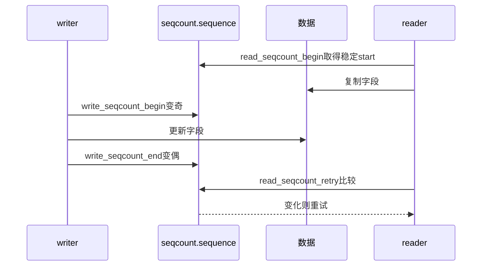

# 第2章\_Linux\_6.12\_seqcount与seqlock模块源码概念导读

## 2.1\_模块问题与职责分支

本章按四条调用链读 `include/linux/seqlock.h`，不按文件声明顺序逐宏罗列。固定提交中的 sequence 为有限宽度无符号字段；行号只用于该版本定位。

## 2.2\_公共对象与检查状态

`seqcount_t` 保存 `sequence`，调试配置下还保存 `dep_map`。`seqcount_init()` 把 sequence 清零并初始化 Lockdep map。KCSAN 在读区标记最多一定数量的后续原子访问，这属于检查器覆盖，不改变真实 sequence。

## 2.3\_普通seqcount调用链

源码入口：`__read_seqcount_begin()`/`read_seqcount_begin()` 在约 266～300 行，retry 在约 348～388 行，writer begin/end 在约 449～503 行。唯一实现见[普通读侧 begin 与 retry](../source_explanations/P01_Linux_6.12_seqlock_h读写与latch源码实现.md#1.3_普通读侧begin与retry)。

## 2.4\_关联锁与PREEMPT\_RT

`SEQCOUNT_LOCKNAME(lockname, locktype, preemptible, lockbase)` 生成四类属性访问：

- 取得底层 seqcount 指针；
- 以 acquire load 读取 sequence；
- 报告 writer 锁是否可抢占；
- 用 `lockdep_assert_held()` 验证 writer 已持有关联锁。

RT 配置下，若关联锁可抢占且 sequence 为奇数，读取属性会执行一次关联锁 lock/unlock，再重新读 sequence，让被抢占 writer 有机会完成。实现见[关联锁属性与 RT 补偿](../source_explanations/P01_Linux_6.12_seqlock_h读写与latch源码实现.md#1.5_关联锁属性与RT补偿)。

## 2.5\_latch双副本分支

`raw_write_seqcount_latch()` 在 sequence 增量前后放置写屏障；begin/write/end 让 reader 在 data[0]/data[1] 之间两次重定向。reader 用最低位选副本，用完整 sequence 在末尾验证。具体实现见[latch 重定向与双副本更新](../source_explanations/P01_Linux_6.12_seqlock_h读写与latch源码实现.md#1.6_latch重定向与双副本更新)。

## 2.6\_seqlock封装与locking\_reader

`seqlock_t` 内含 `seqcount_spinlock_t seqcount` 和 `spinlock_t lock`。writer `write_seqlock()` 先获取锁，再让 sequence 变奇；unlock 先变偶，再释放锁。普通 reader 仍用 `read_seqbegin/read_seqretry` 重试。另有 `read_seqlock_excl()` 直接取得内嵌 spinlock，排斥 writer 和其他 locking reader，不应与无锁重试 reader 混写。

## 2.7\_源码阅读核对

- plain writer 的外部串行权由谁提供，`__seqprop_assert()` 验证什么？
- begin 为什么要处理奇数 sequence，raw begin 又移除了哪段等待？
- latch reader 为什么既用最低位选副本又比较完整计数？
- seqlock writer 的锁与 sequence 更新顺序怎样配对？

总索引：[Linux 6.12 序列计数器源码总阅读索引](P01_Linux_6.12_序列计数器源码总阅读索引.md#1.5_建议阅读顺序)。

上一篇：[Linux 6.12 序列计数器源码总阅读索引](P01_Linux_6.12_序列计数器源码总阅读索引.md)。
