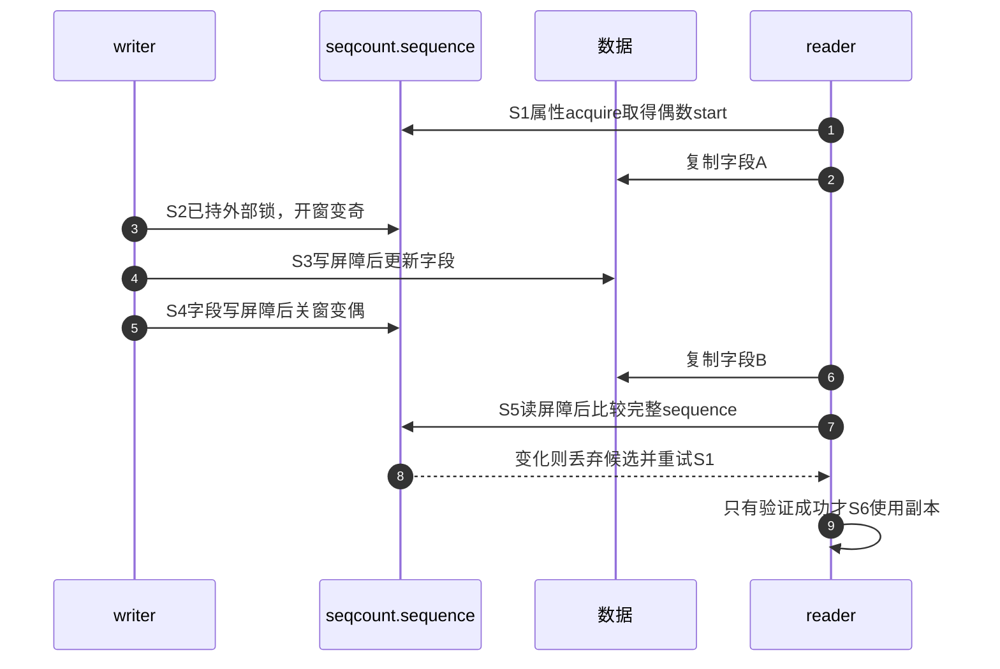
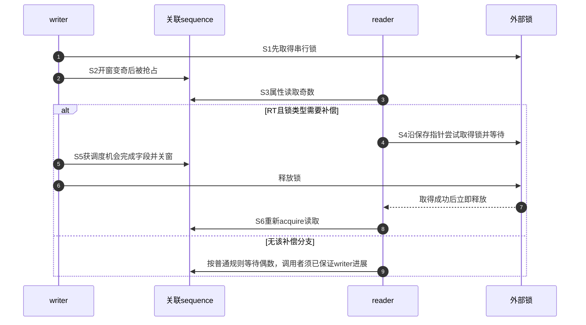

# 第2章\_Linux\_6.12\_seqcount与seqlock模块源码概念导读

## 2.1\_模块问题与职责分支

本章按四条调用链读 `include/linux/seqlock.h`，不按文件声明顺序逐宏罗列。固定提交中的 sequence 为有限宽度无符号字段；行号只用于该版本定位。

固定到总索引所列NXP提交dfaf2136；当前任务是把知识侧快照、进展和双副本模型落到具体地址与函数协作。普通路径先读，遇到已有外部锁和RT配置才进入关联分支；读者必须能打断单副本更新时再读latch。后面的seqlock只是组合封装，不另创造快照证明。

## 2.2\_公共对象与检查状态

`seqcount_t` 保存 `sequence`，调试配置下还保存 `dep_map`。`seqcount_init()` 把 sequence 清零并初始化 Lockdep map。KCSAN 在读区标记最多一定数量的后续原子访问，这属于检查器覆盖，不改变真实 sequence。

结构、配置裁剪和内嵌锁见[类型实现](../source_explanations/include/linux/seqlock_types.h.md#1.2_plain计数与条件检查字段)，构造步骤见[初始化与关联建立](../source_explanations/include/linux/seqlock.h.md#1.2.1_初始化与关联建立)。业务字段仍属于调用者，初始化和回收都不能只依靠sequence是否偶数。

## 2.3\_普通seqcount调用链

源码入口：`__read_seqcount_begin()`/`read_seqcount_begin()` 在约 266～300 行，retry 在约 348～388 行，writer begin/end 在约 449～503 行。唯一实现见[普通读侧 begin 与 retry](../source_explanations/include/linux/seqlock.h.md#1.3_普通读侧begin与retry)。

S0为发布前初始化；S1读取属性后只保存局部start；S2/S4由写者修改共享sequence；S3业务赋值由调用者完成；S5只读取共享证据，不把读者注册进任何名单；S6只消费局部副本。因此局部证据不会汇聚成“所有读者都结束”的全局结论，也没有按读者逐个通知的唤醒路径。具体写核心见[普通写侧实现](../source_explanations/include/linux/seqlock.h.md#1.4_普通写侧begin与end)。

普通Lockdep读访问是短暂的检查器获取/释放记账；它不在业务复制期间持有读锁。KCSAN范围标记也只服务检查，不把实际字段修改变成硬件原子事务。

## 2.4\_关联锁与PREEMPT\_RT

`SEQCOUNT_LOCKNAME(lockname, locktype, preemptible, lockbase)` 生成四类属性访问：

- 取得底层 seqcount 指针；
- 以 acquire load 读取 sequence；
- 报告 writer 锁是否可抢占；
- 用 `lockdep_assert_held()` 验证 writer 已持有关联锁。

RT 配置下，若关联锁可抢占且 sequence 为奇数，读取属性会执行一次关联锁 lock/unlock，再重新读 sequence，让被抢占 writer 有机会完成。实现见[关联锁属性与 RT 补偿](../source_explanations/include/linux/seqlock.h.md#1.5_关联锁属性与RT补偿)。

关联字段的声明还在include/linux/seqlock_types.h：CONFIG_LOCKDEP或CONFIG_PREEMPT_RT任一开启即保留lock指针，所以它不只是检查状态。读者释放关联锁后的新writer仍可能使重读为奇数，不能承诺一次补偿就稳定，更不能把锁覆盖范围扩大到整个候选复制区。知识侧[配置与阶段说明](../../../../knowledge/linux/synchronization_and_asynchrony/synchronization/sequence_counters/P05_关联锁变体与实时性边界.md#5.3_PREEMPT_RT的奇数reader补偿)分别展开这些边界。

这里S编号对应关联锁章节的协作阶段。普通阶段与关联阶段是不同观察角度，前者解释数据一致性，后者解释锁和调度如何避免写者被读者阻止；不能拿后一张图替代前者的字段顺序证明。

## 2.5\_latch双副本分支

`raw_write_seqcount_latch()`在sequence增量前后放置写屏障；begin和write两次重定向，end结束KCSAN标记而不再翻转。data[0]/data[1]由调用者保存，reader用最低位选副本，用完整sequence在末尾验证。具体实现见[latch重定向与双副本更新](../source_explanations/include/linux/seqlock.h.md#1.6_latch重定向与双副本更新)；[210条交错模型](../../../../knowledge/linux/synchronization_and_asynchrony/synchronization/sequence_counters/P04_seqcount_latch双副本状态机.md#4.4.1_用C区分暂停写者与跨CPU交错)解释只比最低位为何失败，不代表内核弱内存已经验证。

按latch的S0～S6读取：S0两份初始化一致；S1先导向副本1；S2调用者更新副本0；S3导回完整副本0；S4更新副本1；S5结束检查范围；S6读者比较完整计数。读者若在S2打断同CPU写者，能选择旧副本1；跨CPU旧读者可能此前已选择副本0，必须靠S6重试。状态和时序见[双副本周期](../../../../knowledge/linux/synchronization_and_asynchrony/synchronization/sequence_counters/P04_seqcount_latch双副本状态机.md#4.3_S0到S6状态周期)，本模块负责把每一步对应到固定函数，不复制函数体。

## 2.6\_seqlock封装与locking\_reader

`seqlock_t` 内含 `seqcount_spinlock_t seqcount` 和 `spinlock_t lock`。writer `write_seqlock()` 先获取锁，再让 sequence 变奇；unlock 先变偶，再释放锁。普通 reader 仍用 `read_seqbegin/read_seqretry` 重试。另有 `read_seqlock_excl()` 直接取得内嵌 spinlock，排斥 writer 和其他 locking reader，不应与无锁重试 reader 混写。

初始化和基础包装的唯一实现见[seqlock与加锁读者](../source_explanations/include/linux/seqlock.h.md#1.7_seqlock封装与加锁读者)。加锁读者不推进sequence，不能在这种读区里悄悄修改业务数据，指望普通重试读者检测它。IRQ/BH变体按执行上下文选择，底层锁及调度器实现不在本专题重复讲解。

## 2.7\_源码阅读核对

- plain writer 的外部串行权由谁提供，`__seqprop_assert()` 验证什么？
- raw_read_seqcount_begin仍等偶数，raw_seqcount_begin不等而清最低位；两者具体交给调用者哪些不同责任？
- latch reader 为什么既用最低位选副本又比较完整计数？
- seqlock writer 的锁与 sequence 更新顺序怎样配对？

总索引：[Linux 6.12 序列计数器源码总阅读索引](P01_Linux_6.12_序列计数器源码总阅读索引.md#1.5_建议阅读顺序)。

上一篇：[Linux 6.12 序列计数器源码总阅读索引](P01_Linux_6.12_序列计数器源码总阅读索引.md)。
