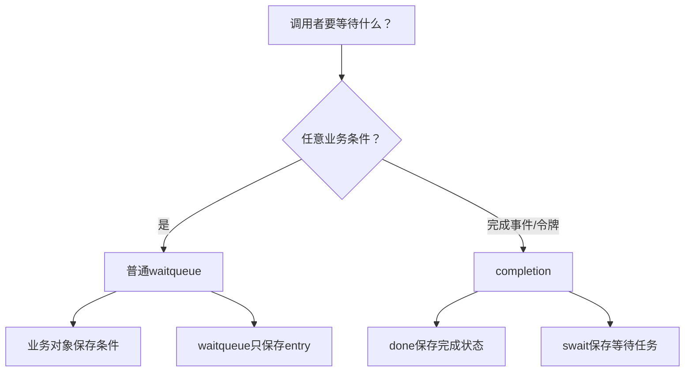

# 第1章\_Linux\_6.12\_等待与完成量源码总阅读索引

## 1.1\_版本边界与阅读任务

源码固定到 NXP `linux-imx` Linux 6.12.20 提交 `dfaf2136deb2af2e60b994421281ba42f1c087e0`。本专题分普通 waitqueue 与 completion 两条状态机：前者保存 waiter 并围绕任意业务条件重检，后者以 `done` 保存完成令牌并用 simple waitqueue 调度等待者。

跨版本模型从[等待队列与完成量专题](../../../../knowledge/linux/synchronization_and_asynchrony/synchronization/waiting_notification/大纲.md#1.1_专题定位)进入。本目录只讲 Linux 6.12.20 的结构、调用链和版本化实现。

## 1.2\_文件地图

| 分支 | 文件 | 职责 |
| --- | --- | --- |
| 普通等待队列 | [`include/linux/wait.h`](../../linux/include/linux/wait.h) | waitqueue/entry、wait_event 宏、wake API |
| 普通等待队列 | [`kernel/sched/wait.c`](../../linux/kernel/sched/wait.c) | 入队、信号竞态、wake 扫描、finish |
| simple waitqueue | [`include/linux/swait.h`](../../linux/include/linux/swait.h)、`kernel/sched/swait.c` | 简化任务 waiter 与唤醒 |
| completion | [`include/linux/completion.h`](../../linux/include/linux/completion.h) | `done + swait` 结构与接口 |
| completion | [`kernel/sched/completion.c`](../../linux/kernel/sched/completion.c) | 令牌增加/消费、等待、广播完成 |

## 1.3\_两条状态机不能合并

这里的“两条”指两种机制的阅读路径，每条内部仍有多组正交状态。普通等待的业务条件、登记链与任务状态不能合为一位；完成量的done、swait登记与外围生命期也不能合并。模块导读分别把它们映射到状态地址和统一阶段，再由实现页展开函数体。

## 1.4\_模块与实现入口

| 阅读目标 | 模块导读 | 唯一实现 |
| --- | --- | --- |
| wait_event、prepare、wake、finish | [普通等待队列模块导读](P02_Linux_6.12_普通等待队列模块源码概念导读.md#2.1_模块问题与状态地址) | [`wait.h` 结构与宏](../source_explanations/include/linux/wait.h.md#1.2_队列头与等待项)、[`wait.c` 入队与唤醒实现](../source_explanations/kernel/sched/wait.c.md#1.2_源码符号覆盖账本) |
| completion 的 done、swait、complete/wait | [completion 模块导读](P03_Linux_6.12_completion模块源码概念导读.md#3.1_模块问题) | [`completion.h` 对象与初始化](../source_explanations/include/linux/completion.h.md#1.2_completion对象与初始化)、[`completion.c` 令牌与等待实现](../source_explanations/kernel/sched/completion.c.md#1.2_源码符号覆盖账本) |

## 1.5\_建议阅读顺序

1. 用[条件等待统一状态机](../../../../knowledge/linux/synchronization_and_asynchrony/synchronization/waiting_notification/P03_条件等待的统一状态机.md#3.4_S0到S7完整周期)写出业务条件、entry、task state 和 runqueue 四个地址。
2. 进入 P02，从 `___wait_event` 宏追到 `prepare_to_wait_event()`，再从 `wake_up*` 追到 `__wake_up_common()`，最后看 `finish_wait()`。
3. 单资源惊群问题留在普通 waitqueue 分支，结合 exclusive flags 与 wake 返回值阅读。
4. 等待“完成事实”时进入 P03，先看 `struct completion`，再看 complete 和 `do_wait_for_common()`。
5. 需要具体函数体时才进入 source_explanations；不要在模块导读复制实现。

## 1.6\_证明边界

调度器 wake 让任务 runnable，不证明业务条件仍成立；waitqueue 锁保护 entry 链表，不保护业务对象；completion 的 done 保存完成令牌，却不停止晚到完成者或保活对象。三种边界在源码阅读中必须始终分开。

实现页按上游头文件和C文件组织，所选结构、宏与函数保持唯一展开。simple waitqueue在此作为completion依赖：模块解释其任务节点和持锁通知，原始文件地图供继续阅读，不表示所有swait、调度器和体系结构函数都已经逐句讲解。当前静态源码对照及知识侧C模型，也不等于目标内核的睡眠、信号、实时配置和超时竞态已经运行验证。

## 1.7\_复核问题

- wait entry、业务条件和 task state 分别由谁写？
- exclusive 唤醒额度为什么依赖回调成功返回？
- completion 提前 complete 为什么不会丢，普通裸 wake 为什么可能丢？
- complete_all 后为什么不能靠 completion_done 判断旧 waiter 已离开？

下一篇：[普通等待队列模块源码概念导读](P02_Linux_6.12_普通等待队列模块源码概念导读.md)。
