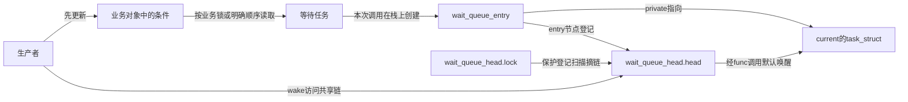
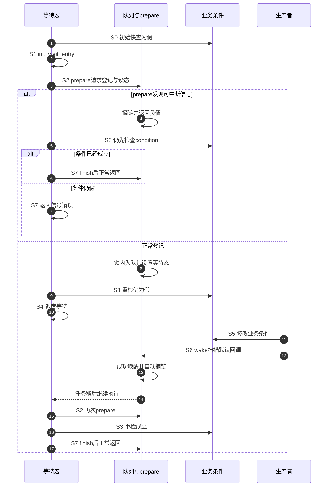

# 第2章\_Linux\_6.12\_普通等待队列模块源码概念导读

## 2.1\_模块问题与状态地址

本章回答 wait_event 如何关闭检查—睡眠窗口。结构体 `wait_queue_head` 的lock保护head所指的共享等待链；栈上结构体 `wait_queue_entry` 保存flags、private、回调和链表节点，其中private在默认任务等待中指向当前任务；`current->__state` 保存任务状态；业务条件位于调用者对象，不在waitqueue中。

## 2.2\_结构与默认回调

`wait_queue_head` 只有自旋锁和链表头。初始化函数 `init_wait_entry()` 设置 `private=current`、`func=autoremove_wake_function`，因此wake扫描通过entry回调进入默认任务唤醒，并在成功时自动移除该entry。自定义回调和poll事件键让同一框架支持更多等待对象。

### 2.2.1\_队列头与栈上entry



业务锁与队列锁不能混用：前者保护条件及资源归属，后者保护通知关系。entry由等待任务准备，登记以后成为共享可达状态；成功回调或退出路径将它摘除以后，栈寿命才有机会结束。结构和宏见[wait.h实现](../source_explanations/include/linux/wait.h.md#1.2_队列头与等待项)，默认初始化与回调见[wait.c实现](../source_explanations/kernel/sched/wait.c.md#1.6_初始化与默认自动摘链)。

## 2.3\_等待侧调用链

[登记空窗教材](../../../../knowledge/linux/synchronization_and_asynchrony/synchronization/memory_ordering/P07_锁_调度_中断与隐式顺序.md#7.7.2_用完整C模型找到登记空窗)以C解释器比较先检查与先登记；它不模拟弱内存。固定wait_event允许快速条件检查，但进入等待循环后仍在prepare之后重检，不能把“先登记再重检”理解为禁止快路径。

```text
wait_event_interruptible(wq, condition)
  → ___wait_event(... TASK_INTERRUPTIBLE ... schedule())
    → init_wait_entry(entry, flags)
    → 循环 prepare_to_wait_event(wq, entry, state)
    → 重新求值 condition
      → 条件真：finish_wait后正常退出
      → 条件假且prepare返回信号错误：沿错误出口返回
      → 仍需等待：schedule后继续prepare与条件重检
```

`prepare_to_wait_event()` 在同一 `wq_head.lock` 下处理“信号退出时删除 entry”与“正常时入队并 set_current_state”，使 wake 与可中断失败不会各自消费同一 exclusive 事件。具体实现见[`prepare_to_wait_event()`](../source_explanations/kernel/sched/wait.c.md#1.3_prepare_to_wait_event登记与信号分支)。

这里先判断condition，再处理prepare返回的信号结果；不能画成每次醒来都执行finish，也不能把信号出口遗漏的finish当成漏清理。prepare信号分支已经摘链，普通退出的finish则恢复任务状态并处理仍在队列中的项。知识侧的[S0～S7四个窗口](../../../../knowledge/linux/synchronization_and_asynchrony/synchronization/waiting_notification/P03_条件等待的统一状态机.md#3.5_逐个关闭检查睡眠窗口)用于对照阶段，源码仍按本页版本和分支阅读。

这三条出口由[___wait_event宏体](../source_explanations/include/linux/wait.h.md#1.3_wait_event宏循环与出口)统一组织；prepare函数只负责其中的队列与任务状态步骤。

### 2.3.1\_正常与信号出口时序



图里的S阶段对应知识侧统一状态机。登记之前已发生的通知由重检持久条件补偿，设态之后的通知则可改变这次睡眠决定；本图选择已经睡眠的正常路径，另外三个时间窗口见知识侧证明。最终成功仍不为读者预留业务资源。

## 2.4\_唤醒侧调用链

下面的扫描链与前面的等待循环协作；它不直接执行用户的消费函数。TASK_INTERRUPTIBLE是可中断等待状态，WQ_FLAG_EXCLUSIVE是等待项的独占额度标志；图中的EXCLUSIVE指后者，不代表取得业务资源的独占权。

```text
wake_up_interruptible(wq)
  → __wake_up(wq, TASK_INTERRUPTIBLE, nr_exclusive, key)
    → __wake_up_common_lock()
      → 持 wq_head.lock
      → __wake_up_common() 遍历 entry
        → entry->func(entry, mode, wake_flags, key)
        → 成功且 EXCLUSIVE 时递减额度
```

非独占entry不消耗exclusive额度。默认回调最终让匹配task进入调度器可运行状态；实际何时运行由调度器决定。逐句实现见[持锁扫描与额度停止条件](../source_explanations/kernel/sched/wait.c.md#1.4_wake_up_common按回调与exclusive额度扫描)；负返回值和额度耗尽都会截断后续访问，不能把它理解为必定访问所有非独占项。

## 2.5\_bookmark与长队列

本章固定提交的 `kernel/sched/wait.c` 中，`__wake_up_common_lock()` 持有队列锁调用 `__wake_up_common()`，后者按flags、回调返回值和exclusive额度决定何时停止；这条实现没有bookmark分段释放队列锁的路径。不能把其他版本的长队列优化移植成当前源码事实。队列长度和回调工作量仍会影响锁持有时间；是否需要改变扫描策略属于独立实现设计，不改变业务条件必须重检的契约。

## 2.6\_waitqueue\_active屏障边界

`waitqueue_active()` 是无锁链表非空观察。头文件明确要求调用者持有队列锁，或在 waker 条件写之后使用额外 `smp_mb()`，与 waiter 的 `set_current_state()` 屏障配对。省掉无条件 wake 的微优化换来严格内存序责任，多数驱动应直接 wake。

## 2.7\_源码阅读核对

- entry 为什么通常在 waiter 栈上，何时才能失效？
- signal pending 与 exclusive wake 并发时，队列锁保护哪个决策？
- wake callback 返回 0 时为什么不能消耗 exclusive 额度？
- `finish_wait()` 为什么先恢复 TASK_RUNNING 再处理链表？

总索引：[等待与完成量源码总阅读索引](P01_Linux_6.12_等待与完成量源码总阅读索引.md#1.5_建议阅读顺序)。

上一篇：[等待与完成量源码总阅读索引](P01_Linux_6.12_等待与完成量源码总阅读索引.md)。

下一篇：[completion 模块源码概念导读](P03_Linux_6.12_completion模块源码概念导读.md)。
