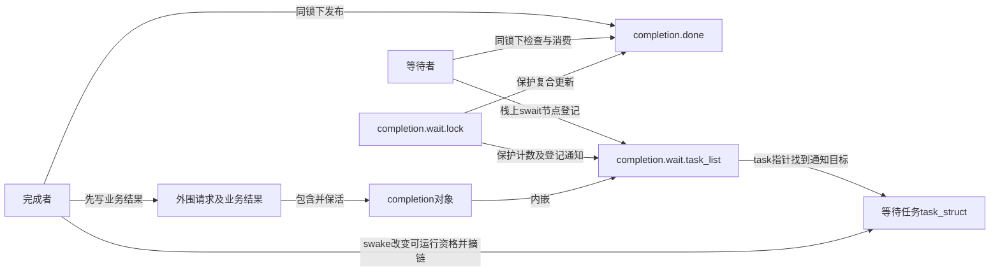
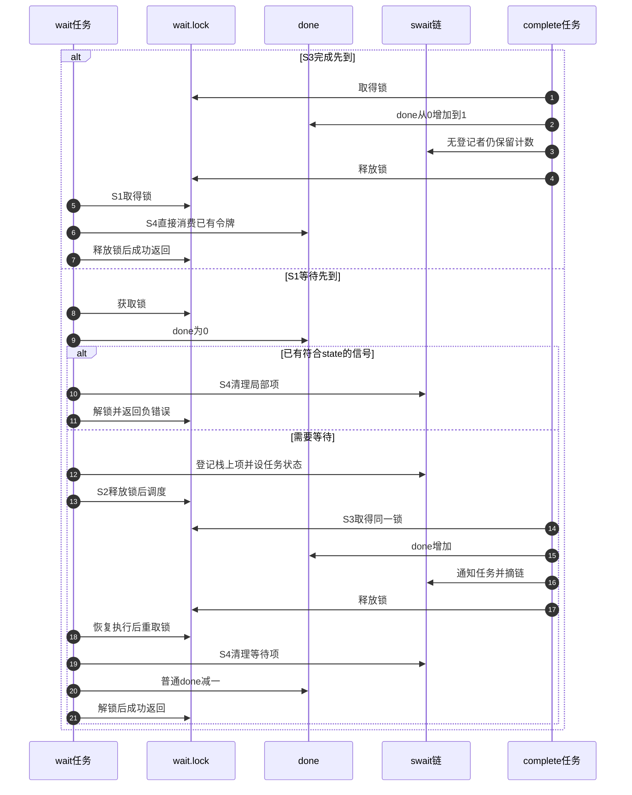

# 第3章\_Linux\_6.12\_completion模块源码概念导读

## 3.1\_模块问题

普通等待队列已解决登记与通知的窗口，但完成者可能早于登记就退出。本章回答一个完成事件怎样在“完成者先到”和“等待者先到”两种交错下都不丢失。completion自己保存done，因此不需要把任意业务条件交给wait_event；simple waitqueue（简化任务等待队列）负责done为零时的任务登记与唤醒。版本固定到NXP linux-imx的Linux 6.12.20提交dfaf2136deb2af2e60b994421281ba42f1c087e0，文件对象见[源码基线](../../linux/SOURCE_BASELINE.md#1.134_完成令牌与swait广播边界)。

## 3.2\_状态所有权

| 状态 | 地址 | 写入者 | 读取者 |
| --- | --- | --- | --- |
| 完成令牌/广播状态 | `completion.done` | complete、complete_all、成功 wait、reinit | 所有 wait/try/done 观察 |
| waiter 链 | `completion.wait.task_list` | wait 与 swake 路径 | complete 唤醒 |
| 串行锁 | `completion.wait.lock` | 发布、登记和消费路径获取/释放 | 序列化done与任务链的复合操作；init/reinit不靠此锁排除旧访问者 |
| 任务状态 | waiter 的 `task_struct` | 等待循环设态、唤醒路径及退出恢复 | 调度器 |

这不是一个done字段就能代表的单一状态机。令牌、登记链、任务可运行状态和外围请求生命期彼此正交：从链上摘除不意味着任务已经返回，令牌为正不意味着没有等待者，超时不意味着生产者停止。

沿用知识正文[S0～S6周期](../../../../knowledge/linux/synchronization_and_asynchrony/synchronization/waiting_notification/P06_completion令牌状态与调用链.md#6.3_S0到S6周期)，在这个版本中按下表定位；阶段可重排，S3可以早于S1，S5可直接发布广播。

| 阶段 | 谁读写哪个状态 | 通信与退出条件 |
| --- | --- | --- |
| S0初始 | 独占构造者初始化done和wait头 | 发布地址前完成 |
| S1检查登记 | 等待者锁内读done；为0时把栈项登记到wait.task_list并设态 | 有令牌转S4；否则解锁进入S2 |
| S2调度 | 等待者调用调度动作；回来后重取wait.lock | 再读done及预算，必要时继续等待 |
| S3计数发布 | 完成者锁内增加done，经swait项的task指针通知一个任务 | 无等待者也保留令牌 |
| S4清理消费 | 等待者先清理已登记项；有普通令牌时减一 | 未取得时返回超时/信号；广播不减 |
| S5广播 | 完成者锁内写UINT_MAX并通知当前队列 | 后续等待同样可以通过 |
| S6复用 | 外围协议确认旧访问者退出后才reinit清零 | 完成量自身不生成新轮次身份 |

结构与初始化见[头文件唯一实现](../source_explanations/include/linux/completion.h.md#1.2_completion对象与初始化)；后续函数均回到这些地址和阶段，不把complete等同于业务资源已归属某个等待者。

## 3.3\_complete路径

`complete()` 进入内部helper，在x->wait.lock下对done做饱和增加并经swake_up_locked通知一个waiter。complete_all直接把done设为UINT_MAX，调用swake_up_all_locked。锁让令牌写和waiter选择成为同一串行阶段。对应[计数发布函数](../source_explanations/kernel/sched/completion.c.md#1.3_complete计数发布)与[持锁广播](../source_explanations/kernel/sched/completion.c.md#1.5_complete_all发布永久完成)。

swait项保存task指针和链表节点，没有普通waitqueue的自定义func或poll事件键。通知路径从链头取得任务，调用调度唤醒再移除该项；完成者不等待被通知任务实际运行。广播使用专用持锁扫描，不能套用通用swake_up_all分段放锁的实现；实际完成返回仍在等待侧S4。

## 3.4\_wait路径

`do_wait_for_common()` 在循环内检查信号、准备 swait、释放锁调度、重取锁再检查 done。成功时只有非 `UINT_MAX` 才消费一个令牌。函数实现见[`completion.c` 令牌与等待源码实现](../source_explanations/kernel/sched/completion.c.md#1.4_do_wait_for_common等待与消费)。

## 3.5\_初始化与复用

`init_completion()` 同时把 done 清零和初始化 swait 头，只用于首次初始化；`reinit_completion()` 只写 `done=0`。后者没有队列锁，也不检查旧 waiter，调用者必须用外部生命周期协议证明可安全开启新一轮。

固定do_wait_for_common在完成与超时交错时，以重新持锁后的done检查决定是否消费；成功至少返回1。complete_all还包含实时上下文断言，不能仅凭其不睡眠就外推所有配置的中断安全。知识侧[轮次反例](../../../../knowledge/linux/synchronization_and_asynchrony/synchronization/waiting_notification/P02_completion_完成量.md#2.6_复用必须排除旧轮次)说明旧请求迟到完成为何可能被新请求误收。

对象寿命的完整应用见[P07 完成与引用模块](../../../../knowledge/linux/object_lifetime/kref/P07_handoff_所有权转移模型.md#7.3.5_completion_场景里的引用归属)：等待者保留独立份额到工作同步退出，超时不自动归还完成方责任。该示例验证的是组合协议，本页的 done 与 swait 状态职责保持独立。

[P22工程契约](../../../../knowledge/linux/object_lifetime/kref/P22_完成事件与等待者工程模板.md#22.1_等待之前先取得合法对象)用同一完整请求继续检查wait输入资格与超时收尾；其[多等待者选择](../../../../knowledge/linux/object_lifetime/kref/P22_完成事件与等待者工程模板.md#22.4_扩展到多个等待者之前)区分广播状态、单次结果发布与对象代次。原completion实现和本模块状态分工不变。

## 3.6\_源码阅读核对

非阻塞接口也要区分取得和观察：[try_wait_for_completion](../source_explanations/kernel/sched/completion.c.md#1.6_try与done观察)锁内重检并消费；completion_done先观察，再经过锁区间，但不消费或锁内重检。两个任务同时观察到真，仍可能只有一个取得令牌。后者尤其不能用于判断广播后的所有等待者都已退出。

- done 为何不是布尔值，`UINT_MAX` 又为何不被 wait 递减？
- complete 早到时，后来的 wait 从哪个地址得到证据？
- swait 锁保护的复合不变量是什么？
- timeout 返回后，哪一条源码路径保证完成者停止？答案为什么是“没有”？

总索引：[等待与完成量源码总阅读索引](P01_Linux_6.12_等待与完成量源码总阅读索引.md#1.5_建议阅读顺序)。

上一篇：[普通等待队列模块源码概念导读](P02_Linux_6.12_普通等待队列模块源码概念导读.md)。
