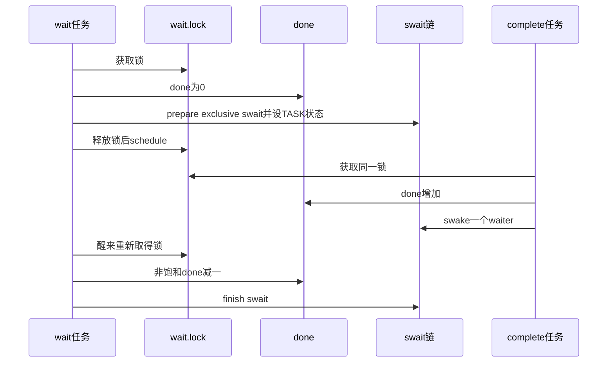

# 第3章\_Linux\_6.12\_completion模块源码概念导读

## 3.1\_模块问题

本章回答一个完成事件怎样在“完成者先到”和“等待者先到”两种交错下都不丢失。completion 自己保存 `done`，因此不需要把任意业务条件交给 wait_event；simple waitqueue 只负责 done 为零时的任务登记与唤醒。

## 3.2\_状态所有权

| 状态 | 地址 | 写入者 | 读取者 |
| --- | --- | --- | --- |
| 完成令牌/广播状态 | `completion.done` | complete、complete_all、成功 wait、reinit | 所有 wait/try/done 观察 |
| waiter 链 | `completion.wait.task_list` | wait 与 swake 路径 | complete 唤醒 |
| 串行锁 | `completion.wait.lock` | 所有 done + waiter 复合操作 | 同上 |
| 任务状态 | waiter 的 `task_struct` | swait prepare/wake | 调度器 |

## 3.3\_complete路径

`complete()` 进入内部 helper，在 `x->wait.lock` 下对 `done` 做饱和增加并 `swake_up_locked()` 一个 waiter。`complete_all()` 直接把 done 设为 `UINT_MAX`，调用 `swake_up_all_locked()`。锁让令牌写和 waiter 选择成为同一原子阶段。

## 3.4\_wait路径

`do_wait_for_common()` 在循环内检查信号、准备 swait、释放锁调度、重取锁再检查 done。成功时只有非 `UINT_MAX` 才消费一个令牌。函数实现见[`completion.c` 令牌与等待源码实现](../source_explanations/P02_Linux_6.12_completion_c令牌与等待源码实现.md#2.4_do_wait_for_common等待与消费)。

## 3.5\_初始化与复用

`init_completion()` 同时把 done 清零和初始化 swait 头，只用于首次初始化；`reinit_completion()` 只写 `done=0`。后者没有队列锁，也不检查旧 waiter，调用者必须用外部生命周期协议证明可安全开启新一轮。

## 3.6\_源码阅读核对

- done 为何不是布尔值，`UINT_MAX` 又为何不被 wait 递减？
- complete 早到时，后来的 wait 从哪个地址得到证据？
- swait 锁保护的复合不变量是什么？
- timeout 返回后，哪一条源码路径保证完成者停止？答案为什么是“没有”？

总索引：[等待与完成量源码总阅读索引](P01_Linux_6.12_等待与完成量源码总阅读索引.md#1.5_建议阅读顺序)。

上一篇：[普通等待队列模块源码概念导读](P02_Linux_6.12_普通等待队列模块源码概念导读.md)。
