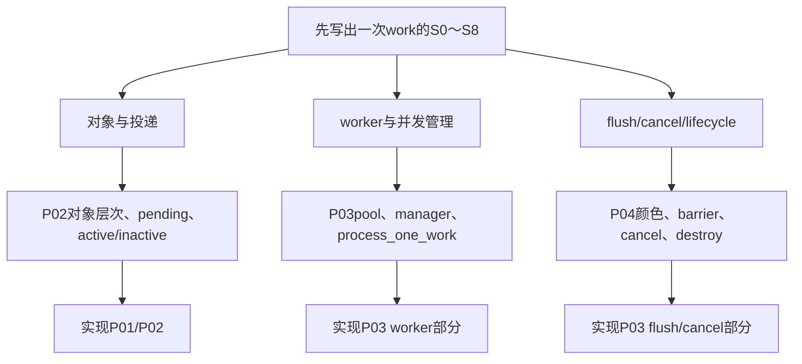

# 第1章\_Linux\_6.12\_工作队列源码总阅读索引

## 1.1\_版本边界与阅读任务

源码固定到 NXP `linux-imx` 标签 `lf-6.12.20-2.0.0` 的 Linux 6.12.20 提交 `dfaf2136deb2af2e60b994421281ba42f1c087e0`。当前 `lf-6.12.y` 工作树比标签前进 3 个提交，本索引仍以固定提交的对象布局和调用链为唯一版本边界。

跨版本模型先读[工作队列专题](../../../../knowledge/linux/synchronization_and_asynchrony/asynchrony/workqueue/大纲.md#1.1_专题定位)。本目录按“对象/投递、worker 管理、flush/取消/生命周期”三条独立任务组织源码，不把约六千行 `kernel/workqueue.c` 按行号顺读。

## 1.2\_核心文件地图

| 文件 | 职责 |
| --- | --- |
| [`include/linux/workqueue.h`](../../linux/include/linux/workqueue.h) | `work_struct` API、flags、delayed/rcu work、attributes 与公共接口 |
| [`kernel/workqueue_internal.h`](../../linux/kernel/workqueue_internal.h) | `struct worker` 与调度器交互内部接口 |
| [`kernel/workqueue.c`](../../linux/kernel/workqueue.c) | pool/pwq/wq、投递、worker、flush、cancel、attrs、rescuer、hotplug |
| [`Documentation/core-api/workqueue.rst`](../../linux/Documentation/core-api/workqueue.rst) | 接口契约、cmwq 设计与亲和范围说明 |

## 1.3\_三条模块分支

## 1.4\_状态层次总表

| 层 | 关键状态 | 汇聚目标 |
| --- | --- | --- |
| work | pending、color、pwq/pool 归属、entry、func | 这一个实例能否入队/执行 |
| pwq | active/inactive、各颜色 in-flight、pool/wq 指针 | 该 wq 在该 pool 上的并发与 flush 证据 |
| pool | worklist、worker/idle、nr_running、manager | 实际执行能力 |
| wq | flags/attrs、pwqs、work/flush color、flusher、rescuer | 逻辑属性域与全局完成结论 |
| worker | current_work/current_pwq、task、scheduled | 哪个 kworker 正代表哪个 work |

## 1.5\_模块与唯一实现入口

| 阅读任务 | 模块导读 | 实现讲解 |
| --- | --- | --- |
| 对象层次与 queue/active | [对象与投递模块导读](P02_Linux_6.12_工作队列对象与投递模块源码概念导读.md#2.1_模块问题) | [对象布局](../source_explanations/P01_Linux_6.12_工作队列对象布局源码实现.md#1.2_源码符号覆盖账本)、[投递与激活](../source_explanations/P02_Linux_6.12_工作队列投递与激活源码实现.md#2.2_源码符号覆盖账本) |
| worker 并发与执行 | [worker 管理模块导读](P03_Linux_6.12_worker管理模块源码概念导读.md#3.1_模块问题) | [worker 执行](../source_explanations/P03_Linux_6.12_worker_flush与取消源码实现.md#3.3_worker_thread与process_one_work执行边界) |
| flush/cancel/destroy | [flush、取消与生命周期模块导读](P04_Linux_6.12_flush取消与生命周期模块源码概念导读.md#4.1_模块问题) | [flush 与取消](../source_explanations/P03_Linux_6.12_worker_flush与取消源码实现.md#3.4_flush颜色与barrier) |

## 1.6\_建议阅读顺序

1. 先读[异步执行抽象状态机](../../../../knowledge/linux/synchronization_and_asynchrony/asynchrony/workqueue/P02_异步执行的抽象状态机.md#2.4_S0到S8完整周期)，明确 work 不是业务事件计数器。
2. 进入 P02 摆出 work → pwq → pool/wq → worker 五层对象，再沿 `queue_work_on()` → `__queue_work()` → `insert_work()`。
3. 进入 P03 追 `worker_thread()` → `process_one_work()` → `work->func()` → `pwq_dec_nr_in_flight()`，同时观察 manager 与 rescuer 慢路径。
4. 进入 P04，先区分 `flush_work`、`flush_workqueue`、cancel 和 drain 的等待对象，再读 color 与 barrier。
5. 最后核对 destroy、CPU hotplug、freezer 和属性更新；这些是执行域生命周期，不是普通 work 的快路径。

## 1.7\_配置边界

当前 `.config` 未启用 `CONFIG_WQ_WATCHDOG`，因此源码存在 watchdog 状态不等于部署中会产生相应告警。WQ_MEM_RECLAIM、UNBOUND、FREEZABLE 等主要是每个 workqueue 的运行时 flags，不应从全局 Kconfig 有无推断某个子系统已正确使用。

## 1.8\_复核问题

- `workqueue_struct` 为什么不等于一组私有线程？
- pending 成功与业务事件完整保存之间差哪一个状态？
- flush 的局部 pwq 证据怎样汇聚成 wq 全局完成？
- cancel 返回后，哪个外部条件才能保证 work 永远不再 queue？

下一篇：[工作队列对象与投递模块源码概念导读](P02_Linux_6.12_工作队列对象与投递模块源码概念导读.md)。
