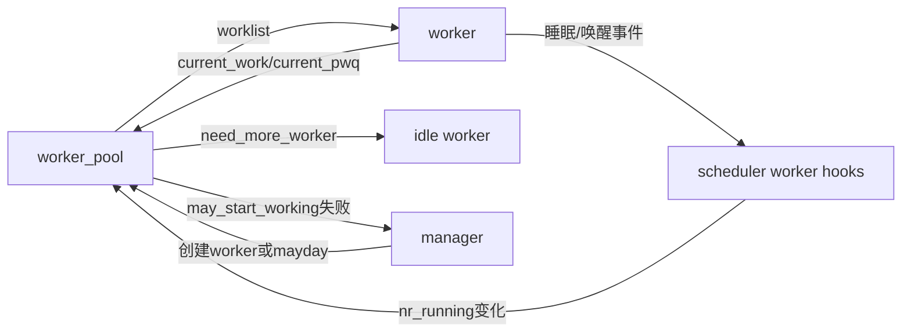

# 第3章\_Linux\_6.12\_worker管理模块源码概念导读

## 3.1\_模块问题

本章回答 pool 如何在 worker 可能睡眠的条件下维持执行能力，以及 work function 前后哪些状态必须写回。投递和 flush 的详细实现不在这里重复。

## 3.2\_pool与worker通信



`worker_pool.nr_running` 不是所有 task 的通用运行计数，而是并发管理需要的 worker 可运行证据；调度器在 worker 睡眠/唤醒边界帮助维护。

## 3.3\_worker\_thread与process\_one\_work

```text
worker_thread(worker)
  → 标记 PF_WQ_WORKER
  → pool lock 下检查 DIE、离开 idle
  → need_more_worker / may_start_working
  → 必要时 manage_workers
  → 从 pool->worklist 移到 worker->scheduled
  → process_scheduled_works
    → process_one_work(worker, work)
      → 记录 current_work/current_func/current_pwq/color
      → 从队列移除并准备执行状态
      → 释放 pool lock
      → worker->current_func(work)
      → cond_resched 与泄漏检查
      → 重取 pool lock，清 current 状态
      → pwq_dec_nr_in_flight()
```

裁剪实现见[worker、flush 与取消源码实现](../source_explanations/P03_Linux_6.12_worker_flush与取消源码实现.md#3.3_worker_thread与process_one_work执行边界)。

## 3.4\_工作函数边界检查

`process_one_work()` 记录调用前的 preempt/Lockdep/RCU 深度，工作函数返回后检查是否泄漏原子上下文、锁或 RCU 读侧。它能发现已执行 work 的部分配对错误，不能证明业务事件已完整处理或 remove 生命周期正确。

非抢占配置还会 `cond_resched()`，防止不断自重排的 work 长期霸占 CPU，并报告 RCU QS。当前 `.config` 未启用普通抢占，这条分支与部署相关。

## 3.5\_manager与rescuer边界

`manage_workers()` 让某 worker 临时承担 manager 角色并按需创建 worker。创建受阻时，WQ_MEM_RECLAIM 队列通过 mayday 列表通知预建 rescuer。rescuer 只挑选需要救援的 pwq work，不替代普通 pool 的长期执行策略。

## 3.6\_复核问题

- work function 执行时为什么不能持有 pool lock？
- current_work/current_pwq 为 flush、诊断和非重入提供什么证据？
- worker 睡眠后，谁发现 pool 需要另一个执行者？
- 工作函数返回后的上下文泄漏检查覆盖哪些状态，遗漏哪些业务事实？

总索引：[工作队列源码总阅读索引](P01_Linux_6.12_工作队列源码总阅读索引.md#1.6_建议阅读顺序)。

上一篇：[工作队列对象与投递模块源码概念导读](P02_Linux_6.12_工作队列对象与投递模块源码概念导读.md)。

下一篇：[flush、取消与生命周期模块源码概念导读](P04_Linux_6.12_flush取消与生命周期模块源码概念导读.md)。
