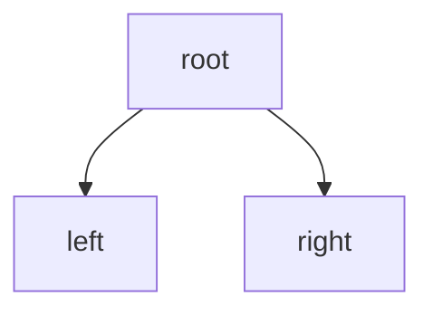
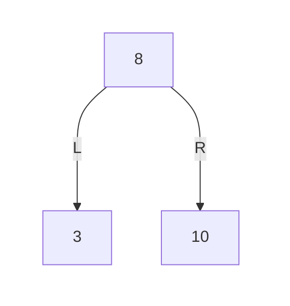
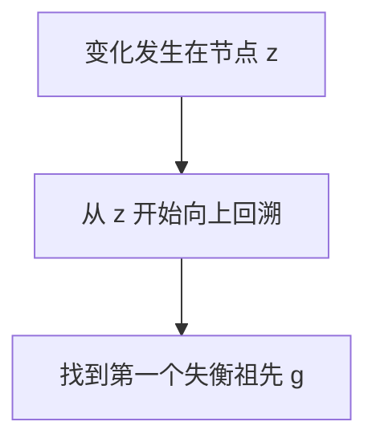

我是 **GPT-5.4 Thinking**。

下面是你当前可整理进备注里的 **Mermaid 输出要求**。

# 第1章_Mermaid_输出要求(当前版本)

## 1.1_基本原则

1. 所有 Mermaid 图都要保证能在 **Typora 的 Mermaid 渲染环境**中正常使用。
2. 输出时使用 **原生 Mermaid 语法**。
3. **不要做 HTML 实体转义**。
   也就是说，不要再写这类内容：
   - `"`
   - `<`
   - `>`

------

## 1.2_文本与节点标签要求

1. Mermaid 图中的 **节点文本统一使用英文双引号包裹**。
2. 常见写法应当像这样：



1. 不要省略双引号。
2. 不要使用额外的 HTML 转义或特殊包装。

------

## 1.3_树结构图的输出要求

1. 画二叉树、BST、AVL、红黑树时，**必须保持结构对称和层级稳定**。
2. 对于不存在的孩子节点，**不能直接省略**，否则 Mermaid 渲染后树形容易歪。
3. 缺失孩子节点时，应使用 **透明占位节点（ghost node）** 补齐结构。
4. 透明节点通常写成：

```mermaid
X_L[" "]
```

然后配合：

```mermaid
classDef ghost fill:transparent,stroke:transparent,color:transparent;
class X_L ghost;
```

必要时再配合：

```mermaid
linkStyle 0 stroke:transparent;
```

把对应连线隐藏掉。

------

## 1.4_分层树图的推荐写法

为了保证树图稳定、对称、可读，优先使用 **分层 subgraph** 方式组织节点。
典型写法如下：



要求：

1. 每一层用一个 `subgraph levelX[" "]`
2. 子图内部一般使用 `direction LR`
3. 子图背景和边框设为透明
4. 树图中尽量按层展开，不要随意堆节点

------

## 1.5_命名统一要求

Mermaid 图里的节点命名，要和正文讲解、伪代码、代码实现尽量统一。
不要出现：

- 图里叫 `A/B/C`
- 正文里叫 `g/p/n`
- 代码里又叫 `root/parent/node`

这种三套命名并行的情况。

推荐做法：

1. **单旋章节** 使用：
   - `x`
   - `y`
   - `T1/T2/T3`
2. **四类失衡 / 双旋章节** 使用：
   - `g`
   - `p`
   - `n`
   - `T1/T2/T3/T4`

这样图、文字、算法、代码可以一一对应。

------

## 1.6_颜色标记要求

为了提高可读性，Mermaid 图中允许并且推荐对关键节点加颜色区分。
当前常用分类如下：

1. **当前局部根 / 当前关注根**
   - `root_node`
   - 浅蓝色系
2. **旋转支点 / 关键孩子**
   - `pivot_node`
   - 浅绿色系
3. **新上移节点 / 新重心**
   - `new_node` 或 `focus_node`
   - 浅黄色系
4. **普通节点**
   - `normal_node`
   - 浅青色系
5. **透明占位节点**
   - `ghost`
   - 全透明

常见写法例如：

```mermaid
classDef root_node fill:#dbeafe,stroke:#1d4ed8,stroke-width:2px,color:#000;
classDef pivot_node fill:#dcfce7,stroke:#16a34a,stroke-width:2px,color:#000;
classDef focus_node fill:#fde68a,stroke:#d97706,stroke-width:2px,color:#000;
classDef normal_node fill:#e0f2fe,stroke:#0284c7,stroke-width:2px,color:#000;
classDef ghost fill:transparent,stroke:transparent,color:transparent;
```

------

## 1.7_二叉树_/_BST_/_平衡树图的特殊要求

1. 缺失左孩子时，要补左侧透明节点。
2. 缺失右孩子时，要补右侧透明节点。
3. 不能因为“某个孩子为空”就直接不画，否则树形会失真。
4. BST、AVL、红黑树这种图，**节点左右位置本身有语义**，必须保持渲染后的左右结构正确。

------

## 1.8_算法流程图要求

对于算法诊断、修复流程，可以使用 `flowchart TD`。
同样要求：

1. 标签用双引号
2. 不做 HTML 转义
3. 文本尽量简洁
4. 节点命名与正文语义一致

例如：



------

## 1.9_不要使用的写法

当前应避免：

1. 使用 HTML 实体转义：
   - `"`
   - `<`
   - `>`
2. 图中节点标签不加双引号
3. 树图里缺失孩子节点却不补透明节点
4. 图、正文、代码三套命名不一致
5. 只画形状，不强调关键节点颜色
6. 二叉树层次混乱，不按层展开

------

## 1.10_一句话版总规则

可以把你的 Mermaid 要求压缩成这句备注：

> Mermaid 图统一使用原生语法，节点标签一律用英文双引号；树图必须补透明占位节点保持结构稳定，分层绘制并用颜色标记关键节点；图中命名需与正文、算法、代码保持一致，不做 HTML 实体转义。

如果你要，我可以继续帮你整理成一个更短的“可直接贴在笔记首页的 Mermaid 规范模板”。