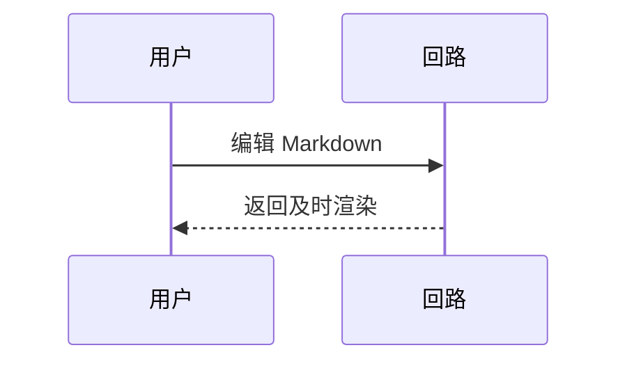
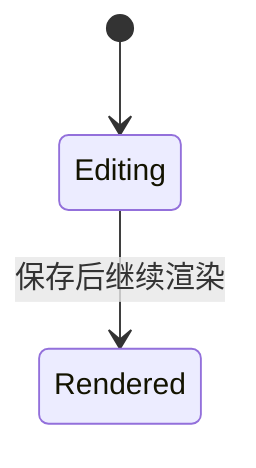

# LOOP_D1C_SMOKE_BODY

Renderer → Preload → Main → Native → Main → Renderer

Worker 实体解码：&copy;

```mermaid
flowchart LR
  LOOP_MERMAID_A[本地编辑] --> LOOP_MERMAID_B[及时渲染]
```

```mermaid
sequenceDiagram
  participant U as 用户
  participant L as 回路
  U->>L: 编辑 Markdown
  L-->>U: 返回及时渲染
```

```mermaid
stateDiagram-v2
  [*] --> Editing
  Editing --> Rendered: 保存后继续渲染
```

