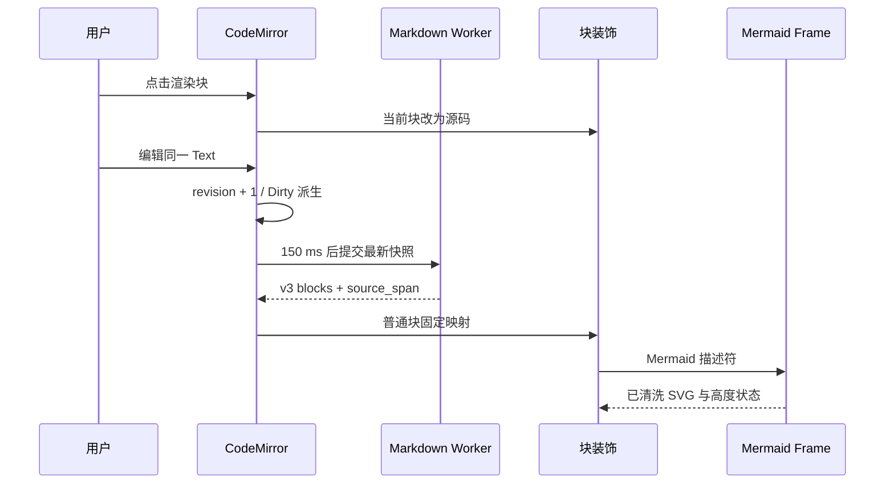

# 第1章\_ADR-0015\_采用\_Typora\_式混合\_Markdown\_编辑面

## 1.1\_状态

`accepted`

本决策于 2026-08-03 在用户明确否决“仅源码 / 侧边预览 / 仅预览”三模式后完成设计评审并接受。它取代 ADR-0008 中“首阶段不实现隐藏源码的混合编辑”和“所有普通文档节点只进入完整 Preview Frame”的交互与放置结论，也取代 ADR-0012 的 whole-document Frame 协议；CodeMirror 草稿所有权、Worker 解析、safe HAST、复杂 renderer 隔离和资源预算继续有效。

## 1.2\_问题与目标

按钮式源码和预览把一次连续写作拆成两个工作区：用户先在源码中编辑，再切换或转移视线确认结果。Mermaid 还未进入 D1C 管线，因此围栏只能显示为代码。这个模型虽便于先建立隔离边界，却不符合当前产品目标：默认界面应像 Typora 一样在同一文档中持续编辑和及时渲染，只有需要查看完整 Markdown 时才按 `Ctrl+/` 进入源码模式。

目标不是建立第二份富文本正文，也不是把预览 HTML反向转换为 Markdown。唯一正文仍是 CodeMirror `Text`；所谓混合编辑，是用可重建装饰把未激活源码块显示为渲染结果，并在用户进入一个块时立即露出该块的原始 Markdown。

## 1.3\_交互决策

- 编辑区只保留一个 CodeMirror 文档面，不再提供“仅源码 / 侧边预览 / 仅预览”按钮、并排预览或旧快捷键。
- 默认使用混合模式：当前选择相交的顶层块显示原始 Markdown，可直接输入；其他顶层块显示对应渲染结果。点击渲染块会把光标放到其源码起点并立即进入局部编辑。
- 编辑事务仍只修改同一个 CodeMirror `Text`，沿用同一撤销历史、Dirty 派生、保存快照、光标与滚动位置。渲染 DOM、块描述符和 Mermaid SVG 都不是正文，也不进入 React 的逐键状态。
- `Ctrl+/` 在混合模式和完整源码模式之间切换；Windows/Linux 使用 `Ctrl+/`，macOS 同时接受 `Meta+/`。从 Mermaid Frame 获得焦点时由固定消息把同一命令转回工作台。
- 当前块编辑后立即进入 150 ms 合并预览。新 Worker 结果到达前，发生变化或无法证明跨度仍有效的块显示源码；不允许旧跨度覆盖新文本。
- 源码模式只改变装饰可见性，不创建第二个 EditorState、不重置撤销历史、不重新读取磁盘，也不改变保存语义。

## 1.4\_块协议与状态流

Worker 与 Mermaid Frame 协议干净升级为版本 `3`，不解析或发送版本 `1/2` whole-document 数据：

```text
PreviewDocument
├── document_id / revision / source_byte_length
├── blocks[]
│   ├── block_id / source_span / content_hash
│   ├── kind = markdown  -> safe_hast
│   └── kind = mermaid   -> mermaid_source
└── diagnostics[] / node_count
```

`source_span` 是当前编辑修订内的 UTF-16 CodeMirror 偏移，必须有序、不重叠且位于文档长度内。`content_hash` 只用于渲染复用，不承担安全、身份或授权含义。Worker 每次仍只处理一个在途任务并只保留一个最新请求；过期修订被丢弃。



## 1.5\_普通块安全边界

普通块可以进入工作台 CodeMirror 装饰，但只能经过两道固定门禁：Worker 先把 Unified 输出规范化为版本化 safe HAST；工作台再用与合约相同的 allowlist 逐节点调用 `createElement` 和 `createTextNode`。禁止 `innerHTML`、原始 HTML、SVG、style、事件属性、表单、iframe、对象、可执行 URL 和工作区 CSS。

链接在这一切片中映射为不可导航文本组件；图片仍映射为阻止占位。即使 Renderer 被视为不可信，文档值也不能扩大 Preload 的固定用例 API。该边界比把任意 HTML 插入工作台更窄，同时避免为每个普通段落创建一个高成本 Frame。

## 1.6\_Mermaid隔离、缩放与主题

- 只有语言标记严格等于 `mermaid` 的代码围栏生成 Mermaid 描述符；单块源码上限 256 KiB，单文档最多 128 个 Mermaid 块，超限安全降级为源码并产生诊断。
- Mermaid `11.16.0` 作为桌面端精确依赖，在构建期打包进固定 `loop-preview://preview/` runtime。运行时不从 CDN、工作区或远程地址加载脚本、主题、字体或配置。
- 每个可见 Mermaid 块使用 `sandbox="allow-scripts"`、无 Preload、无 Node、不同源 Frame。它只接受一次 nonce 绑定的 `MessagePort` 和一个有界描述符，并只能返回 ready、rendered、error、activate、save 或 source-mode 命令。
- Mermaid 使用 `securityLevel: strict`、关闭 HTML label、点击回调和外部资源。返回 SVG 经过 DOMParser 与 SVG 元素、属性、CSS allowlist 重建；脚本、`foreignObject`、事件属性、SVG 动画元素、外部 `href`、非本地 `url(...)` 和 `@import` 一律拒绝。由固定本地 Mermaid runtime 生成的纯视觉 CSS keyframes 可以保留；Frame CSP 保持网络、对象、表单、导航和父 DOM 不可达。
- 工作台和 Mermaid 只提供两组内置 VS Code 风格令牌：Dark+ 与 Light+。首次打开窗口按系统 `prefers-color-scheme` 选择，用户可在顶栏切换当前会话；主题只影响派生 UI，不进入 Markdown、Dirty、撤销或保存状态。窗口设置持久化须由后续 Main 设置能力实现，本轮不得用旧 IndexedDB 或 Renderer 私有存储旁路。
- Mermaid Frame 内提供固定的“缩小 / 百分比复位 / 放大 / 适合宽度 / 编辑源码”工具栏，缩放范围为 50%～300%、步长 25%。超过可视区域后只在图表视口内滚动，不扩大根页面滚动，也不把缩放值写回正文。`Ctrl++`、`Ctrl+-` 和 `Ctrl+0` 分别放大、缩小和复位；`Ctrl+/` 仍进入完整源码。
- Markdown 不得携带主题、CSS、缩放初值或 Mermaid 初始化配置；`%%{...}%%` 配置指令与 Mermaid 代码块内的任何 Front Matter 直接以 `MERMAID_DOCUMENT_CONFIG_REJECTED` 失败关闭，避免配置别名或后续新增配置项绕过边界。runtime 的 `secure` 列表再次锁定主题和各图形初始化键。图表错误只影响本块，用户始终可点击错误块、使用“编辑源码”或按 `Ctrl+/` 查看源码。独立全屏查看器、拖拽平移和跨会话缩放恢复不属于本轮，不为其预留兼容协议。

## 1.7\_资源与性能边界

- 继续使用 5 MiB 源码、100000 safe HAST 节点、64 层深度、12 MiB 结构化数据和 5 秒 Worker 超时。
- 单个 Mermaid 源码仍限制为 256 KiB；生成 SVG 在进入 DOM 前限制为 4 MiB、50000 个元素和 64 层深度，超限只让当前块安全失败并回到源码入口。
- CodeMirror 维护全量块跨度和装饰 RangeSet。非活动标签清空派生装饰并销毁 Mermaid Frame/MessagePort，但保留 EditorState、撤销、光标与滚动；重新激活时从已有块模型重建。普通块不创建 Frame，只有活动标签中的可见 Mermaid 块启动隔离 runtime。
- 文档事务先映射未受影响块的跨度；与变化相交的块立刻退回源码。主题枚举加入消息后预览协议直接升级为 v3，Worker 与 Frame 均拒绝 v1/v2，不维护双协议。
- Mermaid Frame 销毁时关闭 MessagePort、释放 ResizeObserver 和图表 DOM；折叠或滚出 CodeMirror 可视范围不保留隐藏运行实例。
- 主题切换通过同一 CodeMirror StateEffect 重建派生装饰；Mermaid 消息显式携带枚举 `dark | light`，Frame 拒绝未知主题。缩放完全保留在 Frame 内，不触发 Markdown Worker 或 React 正文复制。

## 1.8\_设计评审结论

评审逐项检查了状态所有权、过期结果、XSS、Frame 能力、网络、快捷键焦点、错误恢复、资源上限、主题来源、保存与测试性。结论如下：

1. CodeMirror 仍是正文、选择和撤销的唯一所有者，混合编辑不会产生 Markdown 往返损失。
2. 普通块只消费已验证 safe HAST 并用固定 DOM API 构造，不需要把完整文档交给拥有文件能力的 HTML renderer。
3. Mermaid 仍处于不同源 sandbox，SVG 二次清洗且 CSP 禁网；它不能触达 Preload、父 DOM、文件或任意导航。
4. `Ctrl+/` 是同一 EditorState 上的视图命令，保存、Dirty、冲突和多标签状态不会分叉。
5. 块跨度、变化回退、修订门禁和固定协议均可在纯 TypeScript 测试与 Electron smoke 中验证。

因此允许进入实现；不保留旧三模式 UI、v1 whole-document Frame 消息或兼容快捷键。

## 1.9\_验收

- 打开 Markdown 后默认只出现一个编辑面；没有旧三模式按钮和独立完整预览面板。
- 点击任意已渲染普通块会在原位置显示并编辑源码；完整撤销仍恢复 Clean。
- `Ctrl+/` 往返完整源码模式不改变正文、修订、撤销历史、Dirty 或滚动状态。
- 编辑后最新普通块在合并窗口后更新，过期结果不能回退界面。
- Mermaid flowchart 在混合编辑面中显示为图形，主题与工作台一致；错误图只影响本块并可回到源码。
- 顶栏可在 VS Code Dark+ 与 Light+ 间切换，CodeMirror、资源树、标签、状态栏、普通 Markdown 和 Mermaid 同步更新；切换不改变正文与 Dirty。
- Mermaid 可由按钮和 `Ctrl++ / Ctrl+- / Ctrl+0` 在 50%～300% 范围缩放与复位，放大后使用图表内部滚动，不产生全局滚动条。
- 恶意 HTML、Mermaid、SVG、链接和远程资源不能执行脚本、加载网络、访问 Preload 或导航父窗口。
- 普通块与 Mermaid Frame 均可完全键盘操作；Frame 内 `Ctrl+S` 和 `Ctrl+/` 仍调用工作台命令。

## 1.10\_相关决策

- [ADR-0008：分离 Markdown 编辑与实时渲染管线](0008-separate-markdown-editing-and-rendering.md)
- [ADR-0012：采用有界隔离预览协议](0012-bounded-isolated-preview-protocol.md)
- [ADR-0014：采用冲突检查与句柄相对安全替换](0014-conflict-checked-handle-relative-safe-save.md)
