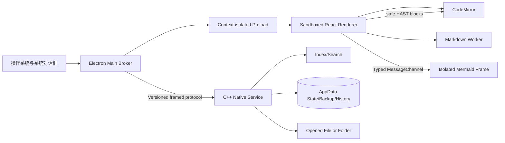
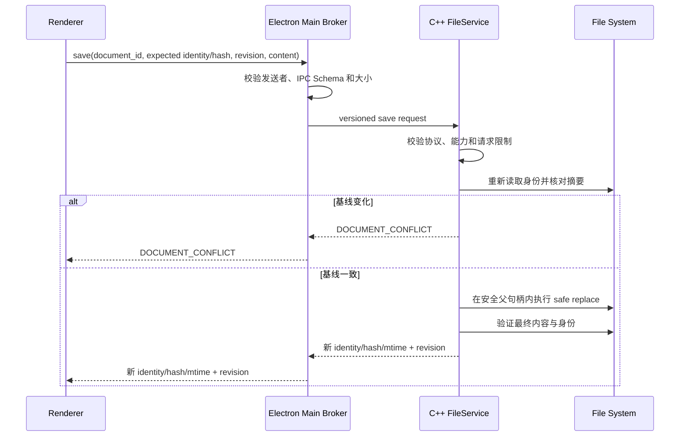

# 第1章\_桌面运行时与文档服务设计

## 1.1\_文档职责与评审状态

本文定义 Electron/C++ 进程边界、工程结构、文件与文件夹能力、IPC、文档保存、恢复备份、Markdown Engine 和资源协议。ADR-0006～0015 已接受，本文已经进入实施，不保留浏览器正式运行、本地 HTTP 文件服务、专题电子书、知识源注册或正文数据库副本。

产品语义见 [文件与文件夹工作区设计](../product/file_and_folder_workspace.md) 和 [Markdown 编辑与实时预览设计](../product/markdown_editing_and_live_preview.md)，安全细节见 [桌面运行时安全与威胁模型](desktop_runtime_security_and_threat_model.md)。

## 1.2\_运行时边界



| 边界 | 允许职责 | 禁止职责 |
| --- | --- | --- |
| Main | 窗口、对话框、会话、协议、更新、C++ 服务生命周期与请求代理 | 文件服务第二实现、React 状态、Markdown DOM |
| C++ Native Service | 能力表、真实路径、文件、监听、备份、历史、索引和搜索 | Electron、React、Markdown DOM、任意命令执行 |
| Preload | 固定用例 API、数据复制、事件适配 | 通用 IPC、Node/Electron 对象、绝对路径 API |
| Renderer | UI、CodeMirror 会话、预览协调与交互 | 文件系统、子进程、数据库、环境变量 |
| Markdown Worker | 解析、清洗、诊断、源码位置 | 文件系统、网络、DOM、Electron |
| Complex Block Frame | Mermaid、公式等复杂 renderer 与块交互 | Preload、Electron IPC、父页面 DOM、导航与任意网络 |
| Index/Search | 在一次 C++ 工作区能力内只读扫描允许根 | 写文件、执行工作区内容、扩大根目录 |

Main 是窗口和系统集成权限所有者，C++ Native Service 是工作区与文件权限所有者；两者都不信任 Renderer。每次 IPC、跨语言协议请求和文件操作仍按 sender、Schema 与当前窗口能力表重新鉴权。

## 1.3\_目标工程结构

```text
practice_tool/
├── apps/
│   └── desktop/
│       └── src/
│           ├── main/
│           │   ├── windows/
│           │   ├── native_service/
│           │   └── protocols/
│           ├── preload/
│           └── renderer/
│               ├── app/
│               └── features/
│                   ├── explorer/
│                   ├── editor/
│                   ├── preview/        # 协调器与无权限 frame runtime
│                   ├── search/
│                   └── settings/
├── packages/
│   ├── ipc-contracts/
│   ├── document-core/
│   ├── markdown-engine/
│   ├── markdown-features/
│   └── ui-foundation/
├── native/
│   ├── CMakeLists.txt
│   ├── CMakePresets.json
│   ├── src/protocol/
│   ├── src/service/
│   └── tests/
├── tests/
│   ├── fixtures/
│   ├── integration/
│   └── e2e/
├── docs/
└── package.json
```

目录按进程边界优先、Renderer 内业务功能次之组织。目标结构不包含 `training-core`、`banks` 或电子书内容包；当前仓库中的这些目录属于待移除的 `0.1.0` 实现，不得进入新包依赖图。

核心 TypeScript package 不依赖 Electron、React 或具体存储驱动。Preload、Main 和 Renderer 只共享 IPC Schema 与纯值对象；Main 与 C++ 服务只共享版本化协议语义和 fixture，不共享运行时对象、动态库 ABI 或文件句柄。

## 1.4\_窗口能力模型

C++ Native Service 为每个窗口持有 `WorkspaceCapability`；Main 只保留窗口 ID 与服务会话的对应关系：

```text
workspace_id
window_id
mode                 # empty | single_file | folder
opened_locator       # Native Service only
canonical_root       # folder only, Native Service only
selected_file        # single_file only, Native Service only
resource_base        # selected file parent, read-only resource boundary
document_handles
resource_handles
watch_subscriptions
```

`workspace_id`、`document_id` 和 `resource_id` 都是当前窗口会话内的不透明随机 ID。Renderer 关闭窗口或工作区后，Main 通知 C++ 服务撤销整个能力表。绝对路径只在系统对话框、Main 到 C++ 服务的一次能力建立请求和 C++ 服务内部出现；需要向用户解释位置时只返回经过目的限制的显示标签。

工作区不是长期注册的“知识源”。“最近打开”只是一条 C++ 服务管理的 locator 记录；重开时必须重新解析真实路径和文件身份，不复用旧能力。

## 1.5\_IPC\_契约

Preload 暴露按用例命名的窄接口：

```ts
interface loop_desktop_api {
  system: {
    get_runtime_info(): Promise<runtime_info>;
  };
  workbench: {
    open_file(): Promise<command_result<opened_single_file>>;
    open_folder(): Promise<command_result<opened_folder>>;
    close_workspace(): Promise<command_result<void>>;
    report_dirty_state(request: {
      workspace_id: string;
      dirty_count: number;
    }): Promise<command_result<void>>;
  };
  explorer: {
    list_children(request: {
      workspace_id: string;
      directory_id: string;
      cursor?: string;
    }): Promise<command_result<entry_page>>;
  };
  documents: {
    open(request: {
      workspace_id: string;
      target_kind: "document" | "entry";
      target_id: string;
    }): Promise<command_result<document_snapshot>>;
  };
}

type command_result<value_type> =
  | { status: "ok"; value: value_type }
  | { status: "cancelled" }
  | { status: "error"; error: desktop_error };
```

这是 D1 已实现接口。`report_dirty_state` 只服务于 Main 的关闭保护，不参与文件授权；`documents.open/save/close` 都只接受不透明能力，保存正文作为独立附件由 Main 构造摘要，Renderer 不提交路径或 Native body 描述符。尚未暴露 `resources`、通用文件操作或任意 shell API。后续切片每增加一个用例，都必须按同样方式增加值对象、运行时校验、能力检查和撤权测试，不能先放一个宽接口等待填充。

每个请求和响应同时具有 TypeScript 类型与运行时 Schema，并限制字符串长度、数组项数、正文大小和嵌套深度。禁止以下接口：

```text
invoke(channel, payload)
read_file(absolute_path)
write_file(absolute_path, content)
watch(absolute_path)
exec(command)
open_external(raw_url)
```

Native 协议版本 `4` 使用 ADR-0011 的 16 字节复合帧：最多 1 MiB 的控制 JSON 与最多 5 MiB 的可选正文附件分别计量。控制 envelope 的 `body` 只能为 `null` 或 `{ kind, byte_length, sha256 }`；成功的 `workspace.open_document` 响应只允许 `markdown_utf8`，`workspace.save_document` 请求只允许 `markdown_source_utf8`，其他方向或方法一律拒绝正文。Main 与 Native 都在分配和业务解析前验证头部，并在解析后验证描述符和摘要；Main 还按 BOM 元数据重建打开时原始字节摘要。Main 的接收缓冲区按倍增容量摊销扩展，不随每个 stdout 分块复制全部历史字节。两端最多保留 64 个待处理项，Main 与 Native 的写队列均为 8 MiB，保证一个最大合法复合帧能够进入有界队列；超过预算失败关闭。协议不支持版本 `3` 降级、Base64 正文或通用流 ID。

事件按工作区和文档订阅，返回不透明订阅 ID；窗口关闭后 Main 必须撤销 Renderer 订阅与资源 URL，并要求 C++ 服务释放 watcher、未完成保存和索引任务。

## 1.6\_文件树与索引

`open_folder` 建立根能力；Renderer 随后用根 `directory_id` 请求首层列表。子目录只接受 Native Service 已签发的 `directory_id`，在展开时再读取，不接受 Renderer 相对路径作为授权依据。每个目录独立维护展开、缓存、分页、错误与刷新代次；刷新撤销旧条目能力，过期响应不得覆盖新代次。只有用户打开 Markdown 后，正文才经文档能力进入 Renderer。

后台索引只解析 Markdown 所需的轻量信息：相对路径、标题、标题锚点和本地链接。它遵守排除规则、大小限制、取消信号和资源预算；遇到巨型目录时降级为按需搜索并显示状态，不要求用户修改系统限制才能打开目录。

索引是可删除缓存，不能保存完整正文，也不能反向写回文件。第一阶段先使用内存加版本化缓存文件；是否引入 SQLite 必须由大型目录基准证明，不能因“以后可能需要查询”预先增加原生数据库驱动与迁移负担。

## 1.7\_文档读取

D1A 的 `workspace.open_file` 只校验所选 Markdown 并返回受控元数据。D1B 的 `workspace.open_document` 接受当前窗口的 `workspace_id + target_kind + target_id`；`target_kind` 只能是已有 `document` 或当前枚举签发的 Markdown `entry`，不接受路径。

`open_document` 返回：

```text
document_id
workspace_id
display_path
content
content_hash
file_version_token
encoding
bom
line_ending
mtime
size
capabilities
```

除元数据外，正文以同一复合帧的 `markdown_utf8` 附件返回，BOM 从编辑正文中剥离但通过 `bom` 保留；磁盘原始字节摘要与附件摘要分别验证。Main 将附件严格解码成 Preload 返回的 `document_snapshot.content`，不会把正文写入状态、日志或第二个文件服务。

C++ Native Service 使用 `filesystem_capability_port` 从根句柄一次解析完整组件链，检查普通文件、大小与类型，并把授权句柄交给 `FileService` 执行读前身份检查、有界读取、严格 UTF-8/NUL 检查、SHA-256 和读后身份检查；业务层不再按绝对路径重开。无效编码不以替换字符继续；二进制、超大或不支持编码返回可操作错误。读取结果中的绝对路径、原始平台文件身份和 OS 文件句柄不跨越 Native Service 协议或 Renderer IPC；保存只使用 Native 保存的随机 token、原始摘要和文档能力。

保存时 Main 把某一 CodeMirror 修订的规范 LF UTF-8 快照作为 `markdown_source_utf8` 附件发送。Native 按 BOM 与换行策略序列化后，再在安全父句柄内创建独占临时文件、写入并刷新、复制允许的元数据、复核目标身份与摘要、原子替换并刷新父目录。成功响应返回新 token、摘要、文件元数据与 `saved_revision`；若保存期间又发生编辑，Renderer 只移动到该旧修订的保存基线并继续显示 Dirty。任何冲突、格式选择、复杂元数据、磁盘满、文件占用或不确定结果都保持 Dirty。

Markdown Front Matter 中的 `id` 是内容元数据，不是文件系统授权依据，也不是文档会话的唯一身份。没有 Front Matter 的普通 Markdown 必须能够正常打开和保存。

## 1.8\_文档保存

保存请求至少携带：

```text
document_id
expected_file_version_token
expected_content_hash
editor_revision
line_ending_policy
body_attachment = markdown_source_utf8
```

C++ Native Service 执行；Main 只完成 sender/Schema 校验、请求关联和结果转发：



D1-SAVE 只对非链接、单硬链接、可完整保持已登记元数据的普通本地文件执行 safe replace：使用同目录临时文件、最小必要权限、刷新、替换和目录刷新。符号链接、硬链接、特殊文件或平台无法安全替换的对象失败关闭；另存为、恢复备份与本地历史仍由后续切片实现，不回退到 guarded in-place。

Renderer 只有在返回修订仍等于当前编辑修订时进入 `Clean`。保存过程中继续输入时，只推进 `saved_revision`，当前文档仍为 `Dirty`。

## 1.9\_恢复备份与应用状态

C++ Native Service 管理四个不同存储区；Main 不保存正文副本：

```text
state/       # 设置、最近打开、窗口布局；小型版本化记录
backups/     # 脏缓冲区的最新恢复快照；不可当作已保存
history/     # 源文件成功保存后的限额本地历史
cache/       # 可删除的索引与渲染缓存
```

小型状态优先使用版本化 JSON 或轻量 key-value 文件，并采用原子写入。第一阶段不引入 SQLite：当前目标没有训练记录、电子书或复杂关系数据，数据库只会增加原生模块打包、迁移、备份和损坏恢复成本。

Renderer 按产品层定义的合并节奏提交最新恢复快照。Main 校验后转发，C++ 服务按 `document_id + revision + content_hash` 再次去重并原子更新单份备份。备份正文、最近打开绝对路径和历史内容不进入日志或遥测。

## 1.10\_文件监听与外部修改

C++ Native Service 将底层重复、乱序和缺失事件归一化为“可能变化”提示，再由 Main 转发：

```text
document_maybe_changed
document_deleted
workspace_entry_changed
workspace_unavailable
```

收到提示后，文件服务重新 stat/read/hash，才生成确定的文档事件。自身保存通过操作 ID 与最终摘要合并事件，但不能因此跳过复检。窗口重新获得焦点、系统从挂起恢复和执行保存前都主动校验已打开文档，弥补 watcher 丢事件。

## 1.11\_Markdown\_Engine

Markdown Engine 拥有固定 Unified 管线：

```text
source
  → remark parse/features
  → MDAST
  → controlled transforms
  → HAST
  → allowlist sanitize
  → block partition + embedded descriptors
  → PreviewDocument
```

Worker 返回可结构化复制的版本 `3` `PreviewDocument`，不返回 DOM、React 元素、原始可执行 HTML 或自定义完整 AST。每个顶层块携带源码跨度、摘要和 safe HAST 或复杂块描述符。普通 safe HAST 由 CodeMirror 装饰使用固定 DOM API 映射；当前选择相交的块直接显示原始 Markdown。Mermaid、KaTeX 等复杂块才通过专用 `MessageChannel` 进入无 Preload、无 Node、不同源且带 sandbox 的 Frame。

D1C 使用完整源码快照产生带源码跨度的块。React 不逐键保存正文；CodeMirror 在 150 ms 合并窗口到期后才生成字符串快照。协调器全局只保留一个在途任务和一个最新待处理任务，Worker 与工作台都严格校验 5 MiB 源码、100000 节点、64 层和 12 MiB safe HAST 预算，过期修订不生成装饰。与编辑变化相交或跨度无法证明有效的块立即退回源码。

复杂块 Frame 只能返回固定的 ready、渲染状态、局部激活、保存和源码模式事件。工作台逐项校验文档 ID、块 ID、修订和 nonce；Frame 不能获得 `loop_desktop_api`、父页面 DOM 或任意字符串命令通道。Mermaid SVG 还要经过固定 allowlist 重建，即使复杂 renderer 出现 XSS，影响也被限制在 Frame 内。

CodeMirror 与 Unified 使用不同解析器，因此每个 Markdown feature 必须提供共同 fixture：合法语法、错误语法、源码位置、编辑高亮、预览结果和恶意输入。不能假设编辑器着色成功就代表预览语义一致。

## 1.12\_资源协议

正式应用使用：

```text
loop-app://app/...                 # 打包应用资源
loop-preview://preview/...         # 打包预览 runtime，独立 origin
loop-resource://resource/<token>   # 当前窗口授权的本地资源
```

Renderer 不能自己把路径编码进 URL。它先把文档 ID 与原始 Markdown 链接交给 Main；Main 转交 C++ 服务规范化并验证能力、边界和类型，再为返回的资源句柄签发高熵、短生命周期、窗口作用域 token。每个窗口使用独立的非持久 Electron session partition，并在对应 `session.protocol` 上注册资源处理器，使 token 与网络存储边界同时随窗口撤销。工作区关闭、窗口关闭或文件身份变化后 token 失效。

`loop-preview://` 只提供固定的 `index.html / runtime.js / styles.css`，并使用独立 CSP、无 Preload iframe、`sandbox="allow-scripts"` 且不授予 `allow-same-origin`、表单、弹窗、下载或顶层导航。由于 sandbox Frame 的文档 origin 为 opaque，scheme 只为这三个固定子资源启用 CORS，并返回 `Access-Control-Allow-Origin: *`；没有启用 `supportFetch`，Frame 的 `connect-src` 仍为 `none`，协议处理器也不接受其他路径。协议不启用 `bypassCSP`、Service Worker 或不需要的存储权限。HTML、脚本、可执行文件和未清洗 SVG 不以内联资源返回。远程资源不经过该协议代理，也不由预览自动请求。

## 1.13\_错误模型

跨进程错误为稳定值对象：

```text
error_code
user_message
retryable
recovery_actions
correlation_id
```

常见错误至少区分：取消、未找到、只读、权限不足、被占用、空间不足、内容过大、编码无效、外部冲突、路径越界、符号链接需确认和工作区失效。Renderer 不获得原始堆栈、绝对路径、文件正文或 OS 句柄。

## 1.14\_开发、打包与测试

开发模式可由 Vite 为 Renderer 提供热更新，但 Main、Preload、Renderer 与 C++ 服务保持正式边界。正式包只加载 `loop-app://` 并启动随包发布的固定 Native Service，不启动 Vite、本地 HTTP 或外部浏览器，也不要求用户预装 Node.js、npm、CMake、编译器、MSYS2、Bash 或数据库运行时。

| 测试层 | 重点 |
| --- | --- |
| 单元 | 会话状态机、路径与链接、保存策略选择、备份合并、Markdown feature |
| Fixture | 编码、换行、HAST 清洗、Mermaid/公式、恶意输入、源码位置 |
| 集成 | Main/Preload Schema、TypeScript/C++ 协议、文件身份、safe write、watcher、备份与历史 |
| E2E | 新建、打开文件、打开文件夹、编辑、预览、保存、冲突、恢复、回收站 |
| 故障注入 | 断电点、磁盘满、权限变化、文件占用、符号链接、硬链接、外部竞态 |
| 性能 | 大文件输入、目录枚举、增量索引、预览延迟、内存与备份写放大 |

## 1.15\_实施顺序

1. 固化 Electron 安全默认值、IPC Schema、C++ 帧协议、错误码和窗口能力表。
2. 建立空窗口、新建文件、打开文件、打开文件夹和最近打开。
3. 完成文件树、CodeMirror Typora 式混合编辑与普通 Markdown 安全块渲染。
4. 完成脏状态、合并恢复备份、Hot Exit、本地历史和外部冲突。
5. 在现有 Markdown Worker 与 safe HAST 上优化细粒度增量解析、缓存和复杂块调度。
6. 在已接通 Mermaid 的基础上实现链接、图片、公式、Callout、Wiki 链接和移动时链接更新。
7. 实现工作区搜索、按需索引、文件操作和跨平台故障注入。
8. 完成签名安装包、安全、性能、键盘与无障碍验收，再删除旧浏览器和电子书实现。

不得把旧页面套进 Electron 后继续使用 HTTP、IndexedDB 或内容包，也不得为了迁移并行维护两套文档所有权。

## 1.16\_相关设计与参考

- [文件与文件夹工作区设计](../product/file_and_folder_workspace.md)
- [Markdown 编辑与实时预览设计](../product/markdown_editing_and_live_preview.md)
- [桌面运行时安全与威胁模型](desktop_runtime_security_and_threat_model.md)
- [Electron：进程模型](https://www.electronjs.org/docs/latest/tutorial/process-model)
- [Electron：IPC](https://www.electronjs.org/docs/latest/tutorial/ipc)
- [Electron：自定义协议](https://www.electronjs.org/docs/latest/api/protocol)
