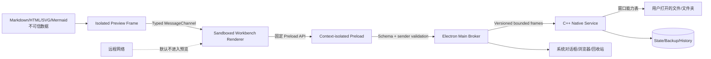

# 第1章\_桌面运行时安全与威胁模型

## 1.1\_文档职责与评审状态

本文定义 Electron + C++ Native Service 架构下的窗口、IPC、跨语言协议、文件与文件夹能力、路径、Markdown、资源协议、网络、备份、文件写入和更新边界。ADR-0006～0010 已接受，本文已经进入实施，用于取代旧本地 HTTP 威胁模型与“注册知识源”权限模型。

## 1.2\_保护目标

- 打开陌生 Markdown 或目录不会执行其中的代码、配置、插件、任务或网络请求。
- Renderer 被攻陷后不能直接读取任意文件、写磁盘、访问环境变量、数据库或启动进程。
- 单文件和文件夹会话不能通过相对路径、编码路径、链接或资源协议逃逸授权边界。
- 每次编辑不会写源文件；保存失败、外部修改和写入竞态不会被静默覆盖。
- 崩溃恢复降低数据损失，但不以每键落盘、无界历史或泄露正文为代价。
- 主窗口永不加载远程页面；外部链接和远程图片不能把本地内容或用户 IP 静默泄露给网络。
- 日志、诊断、更新和崩溃报告不包含正文、恢复草稿、绝对路径或凭据。

## 1.3\_威胁与信任边界



默认不信任：Renderer、IPC 参数、Markdown、原始 HTML、SVG、Mermaid、公式、文件名、相对路径、符号链接、junction、reparse point、UNC、watcher 事件、恢复备份、旧状态文件和所有远程 URL。

Main 拥有窗口与系统集成权限，C++ 服务拥有工作区与文件权限，但两者都不信任输入。打开一个目录只允许读取和显式编辑该目录，不表示允许执行目录中的任何内容。C++ 服务只接受上限 1 MiB 的单行 UTF-8 JSON 帧和方法 allowlist；畸形 JSON、未知字段、空帧、超长帧、协议不匹配和未知方法必须失败关闭，不得触发未捕获异常或无界分配。

## 1.4\_Electron\_安全基线

正式窗口必须显式配置并由自动化测试断言：

```text
nodeIntegration = false
contextIsolation = true
sandbox = true
webSecurity = true
allowRunningInsecureContent = false
```

同时要求：

- 页面只从 `loop-app://app/` 加载，不使用 `file://`。
- 不可信预览只进入 `loop-preview://preview/` 的无 Preload、不同源 sandbox frame，不插入工作台 DOM。
- CSP 至少以 `default-src 'none'` 为基础逐项放行，禁止 `unsafe-eval`、远程脚本和任意 frame。
- 禁止主窗口离开应用协议，拒绝未经处理的新窗口和弹窗。
- 不使用 `<webview>` 展示文档、附件或远程页面。
- 所有权限请求默认拒绝；剪贴板、通知、媒体和定位按具体用例单独评审。
- 校验每个 IPC sender；Preload 不透传 `ipcRenderer` 或原始事件对象。
- 发布构建关闭不需要的 Electron fuses，并持续使用受支持的 Electron 版本接收 Chromium/Node 安全更新。

## 1.5\_打开文件与文件夹的能力

能力只能来自以下用户动作：系统文件选择器、系统目录选择器、操作系统“打开方式”、经过校验的命令行路径或最近打开项的明确重开。Renderer 不能传入绝对路径换取能力。

### 1.5.1\_单文件

- 对选中文件授予读与显式保存。
- 对父目录子树只授予 Markdown 明确引用资源的受控读取，不允许目录枚举。
- 点击另一个 Markdown 链接是新的用户动作；验证后为目标签发独立文档能力。
- 任何越过父目录的路径、绝对路径或链接跳转默认拒绝。

### 1.5.2\_文件夹

- 规范化选择目录并保存根文件身份。
- 枚举、读取、监听和显式文件操作都必须解析到当前真实根内。
- 打开根内符号链接若指向根外，显示真实目标与越界原因；只有用户重新通过系统选择器打开目标后才能访问。
- 工作区关闭或窗口销毁时撤销全部文档、资源、watcher 和索引能力。

“最近打开”只保存 locator，不保存权限。重开时目录被替换、挂载变化或身份不一致，按新对象重新确认。

## 1.6\_路径与文件身份

只比较字符串前缀或只调用 `path.resolve()` 不能构成边界。每次特权操作至少完成：

1. 由不透明 ID 找到当前窗口能力，不接受 Renderer 绝对路径。
2. 拒绝 NUL、非法编码、超限片段和不允许的 URI scheme。
3. 按目标平台规范化分隔符、盘符大小写和长路径。
4. 解析根与目标真实路径，检查符号链接、junction、reparse point、UNC 与挂载变化。
5. 使用跨平台库取得文件标识与类型，在读取前后重新核验身份、大小、修改时间和内容摘要。
6. 在实际读取、保存、移动、删除或签发资源 URL 前再次校验操作能力。

Windows 测试覆盖盘符、UNC、junction、reparse point、大小写和文件占用；Linux 覆盖 symlink、bind mount、权限、rename 与 fsync。特殊文件、设备、socket、FIFO 和目录不能走普通文档读写。

D1A 的项目代码不直接调用 Win32 或 Linux syscall：路径和文件元数据由 libuv 的跨平台接口取得，目录枚举与只读文件流优先使用 C++ 标准库，SHA-256 与 CSPRNG 通过 Mbed TLS 的跨平台接口取得。当前切片对单文件执行“读前身份与大小 → 严格读取和 SHA-256 → 读后身份、大小与修改时间”核验；目录只读取当前层元数据，链接项显示但不签发可展开能力。

这套实现没有宣称标准库文件流具备目录句柄相对打开或原子 compare-and-open 保证，检查与读取之间仍存在极窄 TOCTOU 窗口。D1A 不允许从目录条目读取正文或写盘，所以该窗口目前只影响用户明确选择的单文件只读基线；进入 D1B 正文读取和 D1-SAVE 前，必须用经过评审的跨平台句柄抽象补齐原子身份绑定，不得在业务代码重新引入 Windows/Linux 双实现。

## 1.7\_Preload\_与IPC

Preload 只暴露固定、窄、可撤销的用例函数。Main 对每个请求：

1. 验证 sender frame 仍是当前打包应用页面且属于能力绑定窗口。
2. 用运行时 Schema 校验类型、长度、枚举、正文上限和嵌套深度。
3. 映射为固定 Native Service 方法并设置请求 ID、超时、取消和响应上限。
4. C++ 服务再次校验协议，再把 workspace/document/resource ID 映射为能力对象。
5. 重新验证路径、文件身份、权限、内容摘要和操作状态。
6. 返回稳定错误与恢复动作，不返回异常堆栈、路径或正文。

禁止通用 IPC、通用 Native 方法、任意 SQL、Renderer 文件路径、任意 URL、命令字符串、Shell 参数和底层 watcher 参数。事件回调只能接收复制后的业务值，不能接收 Electron event、C++ 指针、文件句柄或子进程对象。

## 1.8\_Markdown\_与预览安全

- 原始 HTML 默认按文本或固定 allowlist 处理，不执行 script、style、iframe、object、embed、表单或事件属性。
- Worker 输出经过 allowlist sanitizer 的 safe HAST；Renderer 不使用未经清洗的 `dangerouslySetInnerHTML`。
- 工作台通过专用 `MessageChannel` 把 safe HAST 发送给 Preview Frame；Frame 使用 `sandbox="allow-scripts"`，不授予 `allow-same-origin`、表单、弹窗、下载或顶层导航。
- Preview Frame 没有 Preload、Electron IPC 或父页面 DOM，只能返回固定定位、链接点击、复制源码和状态事件；工作台重新校验每个事件。
- 禁止 `javascript:`、`vbscript:`、`data:text/html`、`file:` 和未登记 scheme。
- 代码高亮只生成 token，不执行示例代码；语言映射不能动态 require 工作区模块。
- Mermaid 使用严格模式，关闭点击回调、HTML label、外部脚本和可执行链接；输出再次清洗，不直接信任 SVG。
- KaTeX、Callout 和未来 feature 分别登记允许元素、属性、URL 与资源预算。
- 第一阶段不加载工作区 CSS、JavaScript、插件、主题或可执行配置。

本地 SVG 默认不以内联 DOM 显示。只有经过专用 SVG sanitizer 且禁止脚本、事件、foreignObject、外部引用和动画危险能力后才能预览；在此之前显示占位并允许在系统中查看。

## 1.9\_网络与外部导航

预览默认不发起网络请求。HTTP/HTTPS 图片、样式、iframe、视频和其他远程资源显示占位，不因打开 Markdown 暴露 IP、Cookie、Referer 或阅读时间。

外部链接只有在用户点击或执行“打开链接”命令后才处理：

1. Renderer 分类但不自行导航。
2. Main 使用 URL parser 重新解析，限制长度并只允许 HTTPS；HTTP 需要额外确认。
3. 拒绝用户信息、危险 scheme、本机文件、环回/链路本地管理地址和可疑重定向用途。
4. UI 在交给系统浏览器前显示规范化主机；不得拼接 Shell 命令。

`mailto:`、`tel:` 与自定义协议逐项登记；没有登记即拒绝。主窗口的 `will-navigate` 与 `setWindowOpenHandler` 均默认 deny。

## 1.10\_资源协议

`loop-app://` 只映射打包清单中的固定应用资源。`loop-preview://` 只提供固定预览 runtime，并与工作台使用不同 origin 和 CSP。`loop-resource://` 只接受 Main 基于 C++ 资源句柄签发的高熵、短期、窗口作用域 token，不接受路径、`..`、绝对地址或用户可选 host。

资源 token 绑定工作区、文件身份、允许 MIME、最大大小与过期时间。每个窗口使用独立的非持久 Electron session partition，资源处理器注册在对应 `session.protocol` 上；协议处理器再检查 token 与当前能力。工作区关闭、目标变化、窗口 session 销毁或 token 使用场景不符时拒绝。

协议注册不得启用 `bypassCSP`、Service Worker、任意 Fetch、Cookie 或不需要的 Web Storage 能力。响应设置正确 MIME、`nosniff`、缓存和下载语义；HTML、脚本、可执行文件和未清洗 SVG 不以内联方式返回。

## 1.11\_保存与数据完整性

### 1.11.1\_编辑与备份

编辑事务只在 Renderer 内存中发生。恢复备份按空闲和最大间隔合并写入，使用内容摘要去重；不为每个按键写文件、数据库或历史。

备份目录只允许当前用户访问，备份文件采用原子更新并有总空间上限。应用不声称备份已经加密；若以后需要使用系统密钥链加密，必须单独测试 Windows、Linux 无可用 Secret Service、密钥轮换和无法解密的恢复路径。

### 1.11.2\_源文件

保存使用期望文件身份与内容摘要。safe replace 前后验证目标，保持权限并在 Linux 刷新目录；Windows 处理占用与替换失败。符号链接、硬链接和不能保持元数据的对象不走无条件 rename replace。

普通文件系统没有跨进程强 compare-and-swap，因此仍存在极窄竞态窗口。安全策略是检测、失败关闭、保留恢复备份与本地历史，而不是承诺绝对原子。禁止忽略 watcher、只比较 mtime 或在冲突后自动强制覆盖。

### 1.11.3\_移动与删除

移动、批量链接更新和删除是独立能力，不能复用普通保存。删除默认调用操作系统回收站；无法回收、目标变化、越界或包含脏编辑器时停止。跨文件链接更新逐文件使用期望摘要，并报告部分完成，不能伪造事务性。

## 1.12\_应用数据、日志与隐私

状态、恢复备份、本地历史和缓存使用不同目录与清理策略。应用数据可以保存最近打开绝对路径，但：

- 仅 C++ Native Service 读取正文相关应用数据；Main 只处理窗口设置与经过目的限制的显示标签，Renderer 只获得显示标签和不透明 ID。
- 不进入普通日志、遥测、崩溃上报或导出的默认诊断包。
- 恢复草稿和本地历史不随清缓存删除。
- 清除应用数据需要单独确认，且永不删除用户打开的文件夹或 Markdown。

日志只允许时间、应用版本、稳定错误码、脱敏对象 ID、耗时与 correlation ID。正文、恢复内容、绝对路径、URL 查询、IPC 全载荷、环境变量和令牌默认禁止。

## 1.13\_更新与供应链

- 使用受支持的 Electron 与 Chromium，建立固定升级节奏和紧急安全更新渠道。
- 固定 C++ 编译器支持范围、CMake 最低版本和第三方依赖摘要；严格告警视为错误，并在 CI 建立 clang-tidy、ASan/UBSan 与协议恶意输入测试。
- 锁定依赖与完整性，生成 SBOM，审计许可证和已知漏洞。
- 正式安装包与更新清单签名；更新器只连接固定 HTTPS 发布源。
- Renderer 不执行 Git、npm、包管理器或更新命令。
- 更新失败保留可启动旧版本或进入明确恢复，不修改用户工作区。
- Markdown feature 与 sanitizer 版本随应用发布，不从工作区或远程地址热加载代码。

## 1.14\_安全验收

- Renderer 无法访问 Node、Electron、任意 IPC、绝对路径、环境变量或子进程。
- Renderer 无法连接或替换 C++ Native Service；Main 不接受环境变量、工作区配置或 IPC 指定可执行路径。
- 超长帧、截断帧、无效 UTF-8/JSON、未知字段、未知方法、版本不匹配和异常数值不会造成越界、无界分配、未捕获异常或能力扩大。
- Preview Frame 无法访问 Preload、工作台 DOM、任意导航或文件 IPC；预览 XSS 不能调用保存和文件操作。
- 主窗口导航、弹窗、权限请求与远程加载默认拒绝。
- 单文件模式不能枚举父目录或越过父目录读取资源；文件夹模式不能越过真实根。
- 编码路径、符号链接、junction、reparse point、UNC、挂载变化和 TOCTOU 用例失败关闭。
- 远程图片不自动加载；恶意 Markdown、HTML、SVG、Mermaid、公式和链接不能执行脚本或读取本机文件。
- 连续输入不写源文件且恢复备份写入被合并；清缓存不删除未保存恢复。
- 磁盘满、权限变化、文件占用、外部竞态、硬链接和断电点不会被报告为成功保存。
- 删除进入回收站；移动与多文件链接更新发生冲突时报告准确完成范围。
- 日志、崩溃报告和诊断包不包含正文、草稿、绝对路径或凭据。

## 1.15\_参考基线

- [Electron：安全检查清单](https://www.electronjs.org/docs/latest/tutorial/security)
- [Electron：Context Isolation](https://www.electronjs.org/docs/latest/tutorial/context-isolation)
- [Electron：进程沙箱](https://www.electronjs.org/docs/latest/tutorial/sandbox)
- [Electron：IPC](https://www.electronjs.org/docs/latest/tutorial/ipc)
- [VS Code：Markdown Preview Security](https://code.visualstudio.com/docs/languages/markdown#_markdown-preview-security)
- [VS Code：Workspace Trust](https://code.visualstudio.com/docs/editing/workspaces/workspace-trust)

## 1.16\_相关设计

- [文件与文件夹工作区设计](../product/file_and_folder_workspace.md)
- [Markdown 编辑与实时预览设计](../product/markdown_editing_and_live_preview.md)
- [桌面运行时与文档服务设计](desktop_runtime_and_document_services.md)
- [工作区文件操作与数据安全](workspace_file_operations_and_data_safety.md)
