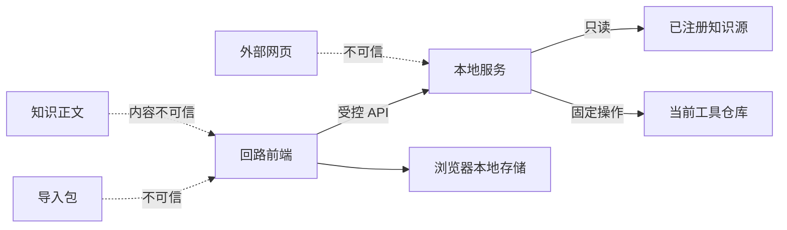

# 第1章\_本地服务安全与威胁模型

## 1.1\_保护目标

回路本地服务可以读取注册知识源、保存用户训练数据和执行受控更新，因此不能把“只监听本机”当成完整安全边界。保护目标包括：

- 外部网页不能借浏览器访问或修改本地服务。
- 知识源读取不能逃逸到注册根目录外。
- 导入内容和 Markdown 不能执行脚本。
- 更新接口不能执行任意 Git、Shell 或文件操作。
- 错误、日志和导出不能泄露答案、令牌和不必要的绝对路径。

## 1.2\_信任边界



默认不信任：

- 任意外部网页和浏览器扩展。
- 导入包。
- 知识正文中的 HTML、链接和指令。
- 用户提供的相对路径。
- 本地符号链接、junction 和 reparse point。
- 来自请求头的 Host、Origin 和转发地址。

## 1.3\_监听与请求来源

- 默认只监听 `127.0.0.1` 和 `::1`，不得自动监听局域网。
- 拒绝未知 `Host`，只接受启动时生成的本地地址和端口。
- 修改状态的请求必须校验 `Origin`，且 Origin 必须与当前应用 Origin 完全一致。
- 不启用通配 CORS，不向外部 Origin 返回许可头。
- 所有修改接口要求高熵本机会话令牌；令牌只存在于当前运行会话内，不写入日志、URL、Git 或持久配置。
- 令牌在服务重启后失效。前端只通过运行时注入获得，不允许第三方页面读取。
- GET 接口也不能仅因“只读”而允许任意跨站读取；响应使用合适的同源和内容类型策略。

上述规则用于防范 CSRF、DNS rebinding 和恶意网页探测本地端口。

## 1.4\_知识源路径

文件型知识源读取流程：

```text
取得已注册 source_id
    ↓
拒绝绝对路径、NUL、非法编码和非支持类型
    ↓
在注册根目录下解析候选路径
    ↓
取得根目录与目标文件 realpath
    ↓
检查目标真实路径仍在根真实路径内
    ↓
检查文件类型、大小和普通文件属性
    ↓
只读打开
```

仅使用字符串前缀或 `path.resolve()` 不足以防止符号链接逃逸。Windows 必须同时考虑 junction、reparse point、盘符大小写和 UNC 规范化。读取前后可比较文件标识，降低检查后替换目标的竞态风险。

默认只读取协议允许的 Markdown 文档。以后支持图片或附件时逐类登记 MIME、大小、打开方式和是否允许浏览器内联显示，不使用用户提供的扩展名直接决定响应类型。

## 1.5\_内容渲染

- Markdown 默认禁用原始 HTML，或经过明确的 allowlist 清洗。
- 禁止 `javascript:`、`data:text/html` 等危险协议。
- 外部链接使用 `noopener`、`noreferrer`，并明确离开本地应用。
- Mermaid 使用严格安全级别，不允许点击回调、任意 HTML 标签或外部脚本。
- SVG 默认作为不可信图片处理，不直接注入 DOM。
- 富文本和预览优先放入受限 iframe，并配置 CSP。
- 训练答案以文本处理，不能因用户输入包含 Markdown 或 HTML 就获得脚本执行能力。

## 1.6\_更新与系统操作

本地服务只暴露固定操作：

```text
检查更新
执行 fast-forward 更新
读取版本和安全状态
读取已注册知识文档
```

- 不接受客户端传入任意 Git 参数、命令、工作目录或删除路径。
- 更新前验证仓库根、分支、远端和工作区状态。
- 工作区不干净时拒绝自动更新。
- 只允许 `--ff-only`，不执行 reset、force、rebase 或自动冲突解决。
- 子进程使用参数数组，不拼接 Shell 命令。
- 更新接口与知识读取接口使用不同服务函数和最小权限。

## 1.7\_请求与资源限制

- 每类接口配置请求体上限、响应上限和超时。
- 原文按单文档读取，不允许一次递归导出整个知识源。
- 对失败的令牌、路径和导入请求做本地速率限制。
- JSON 解析限制嵌套深度和对象数量。
- 取消的请求应尽快停止后端读取。
- 超限错误使用稳定错误代码，不返回部分敏感内容。

## 1.8\_日志与错误

日志允许记录：

- 时间。
- 稳定错误代码。
- 操作类型。
- 脱敏对象 ID。
- 是否可重试。

日志默认不记录：

- 会话令牌。
- 完整用户答案和笔记。
- 导入包正文。
- 未经脱敏的本机绝对路径。
- 知识正文全文。
- 更新凭据。

用户错误响应只返回完成恢复所需的信息。技术诊断可在用户主动导出诊断包时生成，并先预览包含内容。

## 1.9\_安全错误模型

所有服务错误使用：

```text
error_code
user_message
retryable
recovery_actions
correlation_id
```

技术详情只写入脱敏日志，不直接显示堆栈。`correlation_id` 只用于本地关联，不包含时间、路径或用户信息。

## 1.10\_验收条件

- 外部 Origin 无法读取或修改本地服务。
- 修改接口缺少或使用旧令牌时返回拒绝。
- Host/DNS rebinding 测试被拒绝。
- 通过符号链接、junction、UNC 和 `..` 的根目录逃逸均失败。
- Markdown、Mermaid、SVG 和用户答案不能执行脚本。
- 更新接口不能注入 Git 参数或 Shell 命令。
- 超大文档、深层 JSON 和高频失败请求受到限制。
- 日志不包含答案、令牌和未脱敏绝对路径。
