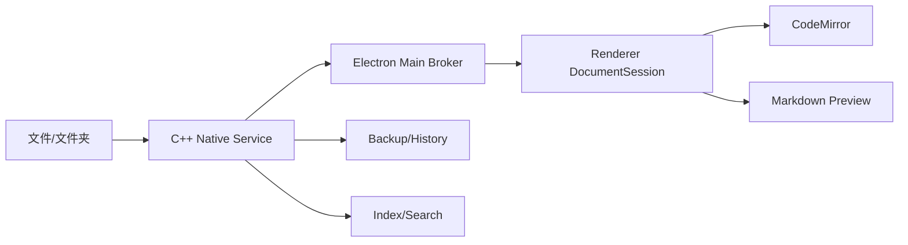

# 第1章\_工程结构与模块边界

## 1.1\_边界原则

目标工程按 Electron 进程边界组织，Renderer 内再按业务 feature 组织。文件系统权限、编辑缓冲区、Markdown 语义和 UI 不放进一个所谓 `shared` 层，也不把旧训练页面迁入桌面壳。

本文依赖已接受的 ADR-0006～0015。当前 `src/`、`banks/`、浏览器存储和启动脚本只属于 `0.1.0`，不得反向约束新结构。

## 1.2\_所有权图



| 状态 | 唯一所有者 | 持久位置 |
| --- | --- | --- |
| 已保存 Markdown | 用户文件系统 | 原文件 |
| 当前草稿与撤销历史 | Renderer DocumentSession | 内存 |
| 恢复快照 | C++ BackupStore | AppData `backups/` |
| 本地历史 | C++ HistoryStore | AppData `history/` |
| 文件与文件夹能力 | C++ WorkspaceService | 内存，最近项只存 locator |
| 窗口与系统对话框 | Electron Main | 内存 |
| 设置与窗口布局 | Main StateStore | AppData `state/` |
| Markdown AST/预览/索引 | Worker/缓存服务 | 内存或 AppData `cache/` |

没有模块拥有 Markdown 正文数据库副本。Front Matter 表单、预览、目录和链接索引都从同一编辑修订派生。

## 1.3\_目录结构

```text
apps/desktop/src/
├── main/
│   ├── windows/       # BrowserWindow 与生命周期
│   ├── native_service/# C++ 服务生命周期与协议客户端
│   ├── protocols/     # loop-app / loop-resource
│   └── update/        # 签名更新边界
├── preload/           # 固定 contextBridge
└── renderer/
    ├── app/           # 装配、窗口布局、命令与快捷键
    └── features/
        ├── explorer/
        ├── editor/
        ├── preview/  # 协调器、消息协议与隔离 frame runtime
        ├── search/
        ├── history/
        └── settings/

packages/
├── ipc-contracts/     # 类型、运行时 Schema、错误码
├── document-core/     # 修订、Dirty/Save/Backup/Conflict 状态机
├── markdown-engine/   # Unified、safe HAST、源码位置
├── markdown-features/ # 内置 GFM/Mermaid/Math/Callout/Wiki
└── ui-foundation/     # 设计 token 与无业务基础组件

native/
├── CMakeLists.txt
├── CMakePresets.json
├── src/protocol/      # 帧、消息与严格校验
├── src/service/       # C++20 Sidecar 入口
└── tests/             # 协议、文件语义与故障注入
```

D1C 已建立 `packages/markdown-engine`，其中 `contracts` 只含可结构化复制的块、safe HAST 值对象、跨度、预算和双端运行时校验，`parser` 才依赖 Unified。Workbench Renderer 只导入轻量 contracts，Markdown Worker 才打包解析器，避免把解析管线带回拥有 Preload 的工作台页面。

## 1.4\_依赖方向

```text
main ───────┐
preload ────┼──> ipc-contracts
renderer ───┘

renderer --> document-core --> markdown-engine
main -----> versioned native protocol -----> C++ Native Service

core packages -X-> Electron / React / Node filesystem / storage driver
renderer -X-> main implementation / absolute paths / Node APIs
native service -X-> Electron / React / Renderer state
```

跨 package 只从公开入口导入。循环依赖、Renderer 导入 Main、core 依赖 Electron/React 和任意字符串 IPC 在构建中直接失败。

## 1.5\_Main\_模块

- `WindowService`：BrowserWindow、系统对话框、会话分区与窗口生命周期。
- `native_service_supervisor`：只启动安装包内固定 C++ 二进制，负责握手、超时、取消、背压与单次恢复。
- `IpcBroker`：校验 Renderer sender 和 Schema，把固定用例映射为 Native Service 方法。
- `ResourceProtocol`：从 C++ 服务返回的受控资源句柄签发窗口作用域 token。

Electron Main 可以依赖 Node/Electron，但不自行实现第二套文件读取、保存、监听、备份、索引或搜索逻辑。C++ 服务拥有这些实现，并且不能接受 Renderer 绝对路径或通用命令。

## 1.6\_Native\_Service\_模块

- `WorkspaceService`：打开文件/文件夹、窗口能力表和最近项定位。
- `filesystem_capability_port`：只封装根句柄相对对象解析、严格单组件校验和平台身份；Linux/Windows 安全原语只能位于该端口，缺失时失败关闭。
- `FileService`：读取、严格解码、文件身份、保存策略和监听复检。
- `FileOperationService`：新建、重命名、移动到回收站和链接更新计划。
- `BackupStore`：合并恢复备份与 Hot Exit。
- `HistoryStore`：成功保存后的限额历史。
- `IndexService`：按需目录枚举、索引、搜索与取消。

C++20 代码使用 RAII、值语义、严格告警和有界输入；不得通过 Node Addon、动态库 ABI 或共享内存把对象所有权泄露进 Electron。

## 1.7\_Renderer\_模块

- `editor` 拥有 CodeMirror 实例与 `DocumentSession`。
- `preview` 的工作台侧拥有调度、Worker 客户端、CodeMirror 普通块固定映射与消息校验；Mermaid 等复杂块运行在无 Preload 的隔离 Frame。
- `explorer` 只消费 Main 返回的相对文件树与操作结果。
- `search` 消费可取消索引/搜索结果，不把结果路径当权限。
- `app` 负责命令、快捷键、标签、区域布局和错误边界，不持有文件实现。

Feature 间通过明确命令和只读 selector 协作。禁止 `utils/`、`services/`、`shared/` 接纳无所有权代码。

## 1.8\_Markdown\_feature

每个内置 feature 提供：

```text
parser extension
sanitizer policy
preview component
CodeMirror support
diagnostics
fixtures and malicious cases
```

Feature 注册在构建期完成。工作区内容不能增加 JS、CSS、解析插件或系统能力；未来插件系统需要独立进程、签名、权限和工作区信任 ADR。

## 1.9\_测试归属

- 纯状态与解析测试放在所属 package。
- IPC、文件身份、保存、备份、历史和协议放集成测试。
- 用户纵向闭环放 Electron E2E。
- Windows 与 Linux 文件系统差异放平台 fixture 与故障注入。
- 每个修复必须在最低能复现该错误的层级增加回归测试，不用 E2E 代替全部单元边界。

## 1.10\_清理边界

桌面闭环验收后删除旧 `src` 浏览器应用、IndexedDB 主存储、本地 HTTP、Bash 最终用户启动链、`banks` 与电子书内容 Schema。不得建立转发接口、双写 repository 或把旧数据模型塞入 `legacy` package。

在实际删除代码前先列出用户数据和发布风险；迁移若被明确要求，必须成为一次性、可回滚的独立工具，而不是长期运行时兼容层。

## 1.11\_相关设计

- [桌面运行时与文档服务设计](desktop_runtime_and_document_services.md)
- [桌面运行时安全与威胁模型](desktop_runtime_security_and_threat_model.md)
- [文件与文件夹工作区设计](../product/file_and_folder_workspace.md)
- [Markdown 编辑与实时预览设计](../product/markdown_editing_and_live_preview.md)
