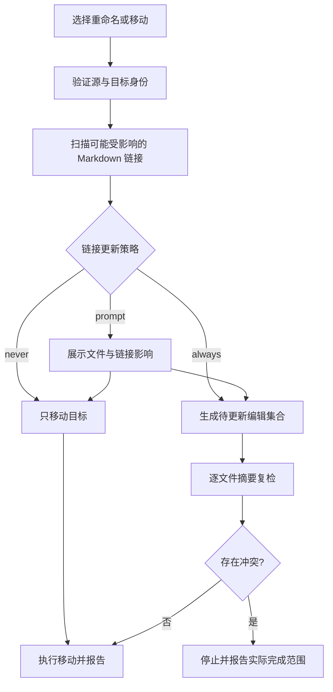

# 第1章\_工作区文件操作与数据安全

## 1.1\_文档职责

本文定义新建、另存为、复制资源、重命名、移动、删除、链接更新、恢复备份和本地历史的数据安全规则。目标产品直接打开磁盘文件与文件夹，不存在把 Markdown “导入”成应用正文副本的流程。

## 1.2\_数据分类

| 数据 | 位置 | 所有权 | 清理规则 |
| --- | --- | --- | --- |
| Markdown 与附件 | 用户选择的磁盘位置 | 用户 | 只能由显式文件命令修改 |
| 内存缓冲区 | Renderer 会话 | 当前编辑会话 | 关闭后由 Hot Exit 规则处理 |
| 恢复备份 | AppData `backups/` | 应用代管 | 保存或明确丢弃后删除 |
| 本地历史 | AppData `history/` | 应用代管 | 按限额和保留策略清理 |
| 设置与最近打开 | AppData `state/` | 应用 | 清除应用数据时删除 |
| 索引与渲染缓存 | AppData `cache/` | 应用 | 可随时重建和清理 |

删除应用、清缓存或重置布局都不能递归删除用户打开的文件夹。清除恢复备份与本地历史必须作为单独的高风险操作说明影响。

## 1.3\_打开不是导入

打开文件只读取该文件；打开文件夹只建立能力边界并按需枚举。应用不得：

- 复制整个目录到 AppData。
- 为了建立工作区而改写 Front Matter、文件名或链接。
- 自动生成 `.loop/`、清单、数据库或锁文件到用户目录。
- 在打开时把全部正文加载到 Renderer 或持久化索引。

拖放文件或文件夹到空窗口等价于打开。拖放资源到 Markdown 编辑器只有在用户明确选择“复制到工作区并插入链接”后才产生写操作。

## 1.4\_单文件写入边界

单文件模式只允许保存已选择文件。下列操作需要新的系统对话框或明确确认：

- 未命名文件第一次保存。
- 另存为其他路径。
- 把剪贴板图片或外部文件复制到相对资源目录。
- 打开或写入当前文件父目录边界之外的目标。

相对资源读取边界不能自动升级成资源写权限。即使预览能够读取 `./images/a.png`，应用也不能擅自在 `images/` 中创建文件。

## 1.5\_文件夹操作

所有目标使用 Main 持有的 `workspace_id + entry_id` 表达。Renderer 不提交绝对路径。操作前重新确认目标身份、真实根、类型、脏编辑器和目标占用。

### 1.5.1\_新建

新建文件或目录先验证父目录仍在根内、名称合法、目标不存在且不是大小写冲突。创建 Markdown 只生成空文件或用户选择的显式模板；不得自动插入仓库专属元数据。

### 1.5.2\_重命名与移动

移动流程为：

普通文件系统无法保证移动和多个 Markdown 保存组成单一原子事务。实现不能用“事务”掩盖部分完成风险；必须在开始前展示影响，在发生冲突后列出已完成、未执行和需要恢复的项目。

### 1.5.3\_删除

默认使用操作系统回收站。删除前检查未保存编辑器与目标身份；失败时停止，不改用永久删除重试。第一阶段不提供递归永久删除。符号链接删除只针对链接本身，不跟随删除目标。

## 1.6\_图片与附件

从外部粘贴或拖入图片时：

1. 预览候选目标目录和最终文件名。
2. 验证目标位于当前文件夹根内，或由单文件模式的 Save 对话框明确选择。
3. 使用无覆盖创建；重名时让用户选择重命名或取消。
4. 文件写入成功后，才向 CodeMirror 插入相对链接事务。
5. 编辑事务失败时不删除已经属于用户的源文件；应用新建的孤立副本可以提示撤销。

远程 URL 默认只插入链接文本，不下载内容。显式下载功能需要单独定义网络、大小、MIME、重定向和隐私策略。

## 1.7\_源文件保存与回滚

普通保存只修改当前文档。写入前验证能力、文件身份和内容摘要；写入后验证结果，再创建本地历史并推进 `saved_revision`。

safe replace 的临时文件必须：

- 位于同一目录并使用不可预测名称。
- 以排他方式创建，权限不宽于目标。
- 只在能确认属于当前操作时清理。
- 不覆盖符号链接、特殊文件或意外出现的同名对象。

如果写入策略可能改变硬链接、ACL、扩展属性或所有权，必须先选择能够保持语义的策略；不能保证时拒绝并提供另存为。保存失败依靠恢复备份与本地历史恢复，不通过重复强制覆盖“修好”。

## 1.8\_恢复备份与本地历史

恢复备份采用单文档最新快照，不是编辑日志。连续输入被合并，空闲、最大间隔、失焦和退出触发刷新；内容摘要不变时不写。

本地历史只记录成功保存版本，并设置：

- 单文件大小门槛。
- 单文件条目上限。
- 总目录空间上限。
- 连续保存合并窗口。
- 明确排除 glob。

历史恢复先打开比较视图，用户确认后把选定版本放入当前内存缓冲区并标记 Dirty；不能绕过编辑器直接覆盖磁盘。

## 1.9\_应用数据清除与卸载

- 清缓存：只删除 `cache/`。
- 清窗口状态：删除布局与最近打开，不删除备份和历史。
- 清恢复数据：列出脏文档数量、最后备份时间和不可逆影响后单独确认。
- 清本地历史：列出空间与文件数量后单独确认。
- 卸载应用：默认保留 AppData；选择同时清除时仍不触碰用户文件与文件夹。

任何清理实现都使用固定目录类型和 Main 计算的应用数据路径，不从配置、日志或 Renderer 参数执行递归删除。

## 1.10\_验收边界

- 打开文件或文件夹不产生正文副本、隐藏文件或目录改写。
- 每键编辑不写源文件、历史或恢复文件；备份写入按修订合并。
- 新建、移动、删除与资源复制都不能越过当前能力边界。
- 删除进入回收站，失败时不提升为永久删除。
- 多文件链接更新冲突时准确报告部分完成，不静默覆盖。
- hard link、symlink、junction、ACL、磁盘满与文件占用测试不会损坏原文件或谎报成功。
- 清缓存、卸载和清应用状态都不删除用户工作区。

## 1.11\_相关设计

- [文件与文件夹工作区设计](../product/file_and_folder_workspace.md)
- [Markdown 编辑与实时预览设计](../product/markdown_editing_and_live_preview.md)
- [桌面运行时与文档服务设计](desktop_runtime_and_document_services.md)
- [桌面运行时安全与威胁模型](desktop_runtime_security_and_threat_model.md)
