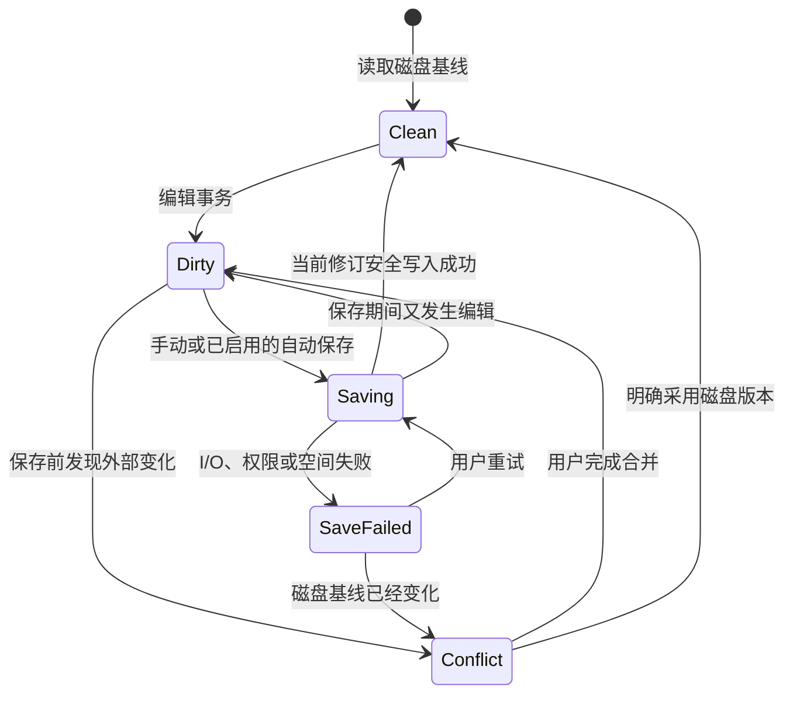
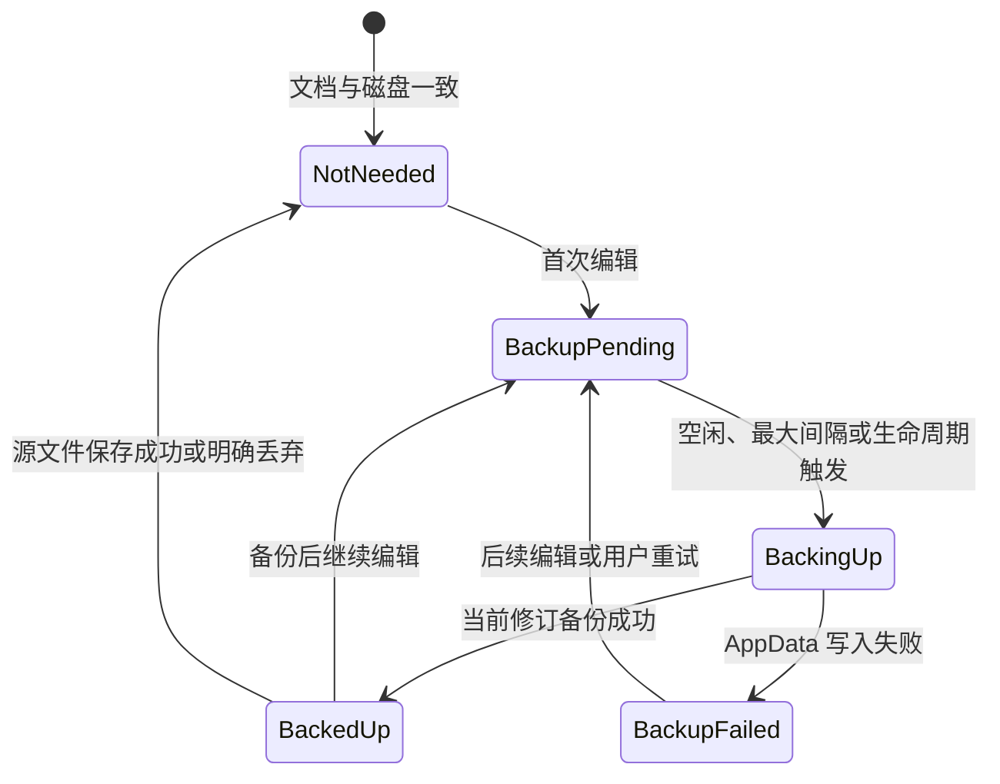
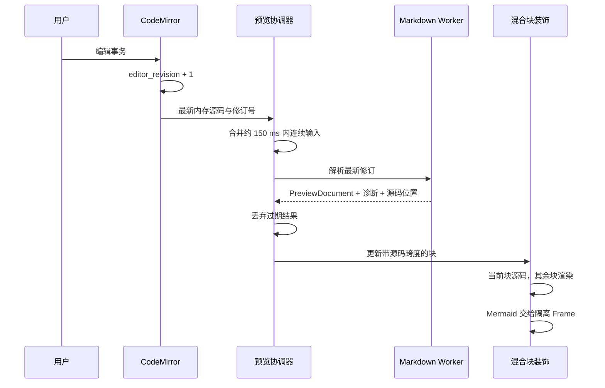

# 第1章\_Markdown\_编辑与实时预览设计

## 1.1\_文档职责与评审状态

本文定义 Markdown 缓冲区、脏状态、源文件保存、恢复备份、外部修改和实时预览。文件与文件夹入口见 [文件与文件夹工作区设计](file_and_folder_workspace.md)。

本文依赖已接受的 ADR-0006～0015 并进入实施。设计已经接受不代表对应代码已经完成；完成度只以 [实现状态与版本边界](../implementation_status.md) 为准。

D1C 已在 D1B 的 CodeMirror 内存缓冲区、撤销历史、单调修订和 Dirty 派生之上接通预览管线。ADR-0015 把它收敛为 Typora 式单一混合编辑面：停止输入约 150 ms 后，Worker 解析最新完整内存快照并返回带源码跨度的版本 `3` 顶层块；当前块显示源码，其他普通块由固定 safe HAST 映射渲染，Mermaid 在不同源、无 Preload 的 sandbox Frame 中渲染。`Ctrl+/` 只切换完整源码装饰，`Ctrl+S` 保存发起时的不可变 CodeMirror `Text`。Native 按 token、文件身份和原始摘要拒绝外部冲突，并以根句柄相对安全替换提交。恢复备份与 Hot Exit 尚未实现，因此窗口关闭 Dirty 草稿时仍需“放弃修改 / 取消”确认。1 MiB 预览性能尚未达到 300 ms 门禁，因此实现状态保持 `IN_PROGRESS`。

## 1.2\_核心原则

- 磁盘 `.md` 是已保存正文的唯一权威版本。
- CodeMirror 内存缓冲区是当前编辑会话的权威草稿。
- 每次按键只修改内存事务并安排预览，不写源文件、不创建一条历史记录。
- 默认手动保存；`Ctrl+S` 才把当前缓冲区写回源文件。自动保存是用户主动开启的偏好。
- 恢复备份与源文件保存是两个独立状态机；“已备份”绝不能显示成“已保存”。
- 预览、语法树、HTML、Mermaid SVG 和索引都是可重建派生数据。
- 任何保存路径都不能用最后写入者获胜静默覆盖外部修改。

## 1.3\_文档会话

每个打开文档建立一个 `DocumentSession`：

```text
workspace_id
document_id
display_path
base_file_identity
base_content_hash
editor_revision
preview_revision
saved_revision
backup_revision
encoding
line_ending
dirty
save_state
backup_state
external_state
```

`editor_revision` 每个可撤销编辑事务递增。`preview_revision`、`saved_revision` 和 `backup_revision` 分别表示预览、源文件和恢复备份确认处理到的版本。三个值不能互相代替。

Front Matter 是同一源码缓冲区的一部分。属性表单若存在，只能生成普通 CodeMirror 事务并进入同一撤销历史，不能拥有独立正文副本。

## 1.4\_从输入到磁盘的节奏

| 事件 | 动作 | 是否写源文件 |
| --- | --- | --- |
| 每次编辑事务 | 更新内存、标记 Dirty、递增修订 | 否 |
| 停止输入约 150 ms | 合并并提交最新预览任务 | 否 |
| Dirty 后空闲约 2 s | 合并写入一份最新恢复备份 | 否 |
| 持续编辑达到约 30 s | 强制刷新一次恢复备份 | 否 |
| 窗口失焦、正常退出或系统挂起通知 | 尽力立即刷新恢复备份 | 否 |
| `Ctrl+S` / 保存命令 | 执行冲突检查和安全保存 | 是 |
| 用户启用自动保存且条件满足 | 调用与手动保存相同的保存流程 | 是 |

时间值是首版默认值，最终应由性能与故障注入测试校准。恢复备份按文档合并：只有最新内容摘要与已备份版本不同才写入，旧的待执行任务被取消。不得为每次按键写数据库、JSON、临时文件或本地历史。

## 1.5\_源文件保存

### 1.5.1\_默认与自动保存

默认 `files.autoSave = off`。用户可以主动选择：

- `afterDelay`：停止编辑达到配置延迟后保存，延迟不得小于 1000 ms。
- `onFocusChange`：脏编辑器失去焦点时保存。
- `onWindowChange`：应用窗口失去焦点时保存。

所有模式都复用同一个冲突检测与写入服务。自动保存遇到外部冲突、权限、只读、空间不足或元数据无法保持时进入持续可见的失败状态，不循环重试，也不降级为强制覆盖。

### 1.5.2\_保存状态机



标签圆点与资源管理器计数表示 `Dirty`。`Saving`、`SaveFailed`、`Conflict` 常驻显示；发起保存不等于成功。

### 1.5.3\_安全写入策略

打开时记录文件标识、大小、mtime、内容摘要、权限、编码、BOM 与换行。保存前重新取得文件身份并校验摘要；watcher 事件只能用于提前提示，不能替代这次检查。

普通单链接文件优先采用同目录临时文件、刷新、再次校验基线、替换和目录刷新构成的 safe-write。实现必须保持权限并明确处理 Windows 占用与 Linux rename/fsync 语义。

原子替换会改变文件身份，因此不能无条件用于符号链接、硬链接、多链接文件、特殊文件或无法保持元数据的文件。当前 D1-SAVE 只开放可验证的普通单链接文件安全替换：

- 符号链接、硬链接、多链接文件、特殊文件和无法完整保持已登记元数据的文件拒绝保存，后续由“另存为”能力处理。
- 平台不能完成根句柄相对安全替换时失败关闭，不回退到路径 API 或 guarded in-place。
- 只有 D2 恢复备份与本地历史落地并通过故障注入后，才能另行评审是否扩大原地写入范围；失败后始终不得把半写入结果宣称为成功。

普通文件系统无法提供跨进程的完美 compare-and-swap。实现通过写前摘要、替换前复检、文件身份、watcher 提示和本地历史缩小竞态窗口，并在检测到竞态时进入冲突；文档不得声称已经消除所有外部编辑器竞争。

### 1.5.4\_格式保持

未修改文件不会因打开或预览发生字节变化。保存默认保持编码、BOM 与换行风格；解码无效时以只读方式打开并要求用户选择编码，不能用替换字符静默损坏正文。格式化、标题编号、尾随空白处理和链接重写都是独立可撤销命令，默认不绑定保存。

## 1.6\_恢复备份与Hot\_Exit

### 1.6.1\_备份状态机

恢复备份位于当前用户专属的应用数据目录，每个脏文档只保留一份最新可恢复快照和必要元数据：文档身份、磁盘基线摘要、编辑修订、内容摘要、正文和更新时间。备份文件自身采用临时文件加替换写入，并限制目录 ACL/权限。



`BackedUp` 只表示可以尝试恢复该编辑修订，文档仍是 `Dirty`。备份失败不阻止继续编辑，但必须常驻提示数据风险；不能通过缩短到逐键写入规避设计问题。

### 1.6.2\_关闭与恢复

关闭行为参考成熟编辑器：

- 关闭一个脏标签：显示“保存 / 不保存 / 取消”。
- 正常退出应用或关闭整个窗口：默认 Hot Exit，先刷新恢复备份并在下次启动恢复，不写源文件。
- 明确选择“不保存”或“还原文件”：确认后丢弃内存草稿和恢复备份。
- 硬崩溃、断电或操作系统拒绝退出等待时，允许丢失最后一个尚未进入恢复备份窗口的短时间编辑；不能用每键落盘换取虚假的绝对保证。

启动恢复时比较备份基线与当前磁盘摘要。相同则恢复为 `Dirty`；不同则打开三方比较，不自动选择任何一侧。

## 1.7\_本地历史

本地历史只在源文件成功保存后创建，不按编辑事务创建。默认启用并采用限额与合并窗口，例如：

- 同一文件短时间连续保存合并为一个历史点。
- 单文件条目数、总空间和单文件大小均有上限。
- 超限按最旧优先清理，不影响恢复备份。
- 历史位于应用数据目录，不写入工作区，不替代 Git。

本地历史、恢复备份和磁盘文件必须使用不同目录与生命周期，清缓存不能删除前两者。

## 1.8\_实时预览

### 1.8.1\_修订驱动



预览永远消费内存缓冲区，不重新读取磁盘，也不触发源文件或恢复备份写入。输入线程不等待 Markdown、Mermaid、公式或代码高亮完成。

### 1.8.2\_预览模型

Markdown Worker 返回标准 MDAST/HAST 生态上构建的最小 `PreviewDocument`，不再设计一套完整私有 AST：

```text
revision
blocks[] = { block_id, source_span, content_hash, safe_hast, embedded_descriptors, diagnostics }
outline
links
```

`safe_hast` 已经过固定 allowlist 清洗；普通块在 CodeMirror 装饰中用固定 DOM API 映射，禁止 `innerHTML`、原始 HTML、style、事件属性和导航。Mermaid、数学公式和其他可执行面较大的复杂 renderer 以描述符进入无 Preload、不同源的 sandboxed Frame。工作台内置 VS Code Dark+ 与 Light+ 两套令牌；当前会话主题作为严格枚举进入 Mermaid Frame。Mermaid 配置指令与 Mermaid 代码块内的任何 Front Matter 被拒绝，避免配置别名或后续新增配置项覆盖边界；runtime 再以 `secure` 键锁定主题、CSS、HTML label 与各图形配置，Markdown 不能提交主题或覆盖 Frame UI。普通 Markdown 文档的 Front Matter 不受这条 Mermaid 专用边界影响。

ADR-0015 使用版本 `3` 的 `blocks + source_span + content_hash` 模型，并在 Mermaid Frame 消息中加入严格的 `dark | light` 主题枚举；v1/v2 均不解析。协议保持 5 MiB UTF-8 源码、100000 个节点、64 层深度和 12 MiB 结构化树预算，单 Worker 只允许一个在途任务和一个最新待处理快照；超时 5 秒后终止并重建。不维护 whole-document、旧块协议或旧 Frame 消息双轨。更细粒度增量解析和缓存仍由后续性能切片落实。

### 1.8.3\_复杂块与错误

复杂块按内容、主题和渲染器版本缓存，并在接近视口时优先执行。当前源码出错时保留上一次有效图形，但必须标注“预览来自旧修订”；原始围栏始终可见。一个块失败不能阻止其他正文更新。非活动标签销毁全部复杂块 Frame 与 MessagePort，但保留 CodeMirror 文档会话和已验证块模型，重新激活时再重建派生渲染。Mermaid 的 50%～300% 缩放是 Frame 内视图状态，只改变 SVG 显示宽度和局部滚动位置，不触发重新解析、正文修订或保存。

## 1.9\_源码与预览同步

每个顶层块保存源码偏移与修订号。当前选择相交的块直接显示源码；点击其他渲染块把光标移动到该块源码起点。源码与渲染共享同一个 CodeMirror 滚动容器，不再维护双面板滚动同步。`Ctrl+/` 切换完整源码模式，切换不改变 EditorState、撤销历史或 Dirty。

## 1.10\_Markdown\_能力

内置基础能力：CommonMark、GFM、YAML Front Matter、代码围栏、标题锚点、相对链接、图片和脚注。内置增强能力：Mermaid、KaTeX 数学公式、受控 Callout，以及可配置的 Wiki 链接解析。

所有 feature 在构建期登记，必须同时提供解析、固定渲染组件、CodeMirror 支持、安全策略和 fixture。第一阶段不加载目录中的 JavaScript、主题脚本或第三方可执行插件。未知围栏和语法保留源码并安全降级。

## 1.11\_链接与资源

| 链接 | 文件夹模式 | 单文件模式 |
| --- | --- | --- |
| `#标题` | 当前文档定位 | 当前文档定位 |
| `./a.md` | 根内打开并可索引 | 用户点击后验证并打开父目录边界内目标 |
| `/docs/a.md` | 相对工作区根 | 无工作区根，报告诊断 |
| `../a.md` | 规范化后仍在根内才允许 | 不得越过当前文件父目录 |
| 本地图片 | 根内受控资源 | 父目录边界内受控资源 |
| HTTP/HTTPS 链接 | 用户动作后交给系统浏览器 | 同左 |
| HTTP/HTTPS 图片 | 默认阻止网络加载 | 默认阻止网络加载 |

移动文件时链接更新默认询问，符合 `never / prompt / always` 三态。自动更新仍使用多文件摘要检查；发生歧义或外部变化时停止，不猜测目标。

## 1.12\_外部修改与冲突

- `Clean` 文档检测到外部变化后自动重新读取，并尽量恢复光标与滚动锚点。
- `Dirty`、`Saving` 或 `SaveFailed` 文档检测到变化后进入 `Conflict`。
- 文件删除时保留内存与恢复备份，允许另存为或关闭。
- 文件移动只在文件身份和工作区索引能够唯一确认时自动跟随，否则显示失联。

冲突视图至少提供打开时基线、本地草稿和当前磁盘版本。用户可以比较、合并、采用磁盘、保留本地后另存为；不存在自动“本地优先”或“磁盘优先”。

## 1.13\_验收边界

- 连续输入 60 秒不会对源文件执行写入，默认设置下也不会每键写恢复存储。
- `Ctrl+S` 成功前始终保持 Dirty；已备份状态不显示成已保存。
- 自动保存默认关闭，启用后与手动保存共享冲突与失败语义。
- 异常退出可以恢复最近合并备份，且明确允许丢失尚未到备份窗口的最后短时编辑。
- 外部修改、符号链接、硬链接、权限变化和磁盘空间不足经过故障注入时不静默破坏原文。
- 实时预览不读取磁盘、不阻塞输入、不执行 Markdown 中的脚本或远程资源。
- 编辑器与预览支持标题、链接、图片、Mermaid、公式、源码定位和键盘操作。

## 1.14\_参考基线

- [VS Code：保存、Auto Save 与 Hot Exit](https://code.visualstudio.com/docs/editing/codebasics)
- [VS Code：Markdown 编辑、预览同步、链接更新和预览安全](https://code.visualstudio.com/docs/languages/markdown)
- [VS Code：Local History](https://code.visualstudio.com/docs/editing/userinterface#_local-history)

## 1.15\_相关设计

- [文件与文件夹工作区设计](file_and_folder_workspace.md)
- [桌面运行时与文档服务设计](../engineering/desktop_runtime_and_document_services.md)
- [桌面运行时安全与威胁模型](../engineering/desktop_runtime_security_and_threat_model.md)
- [产品导航与交互设计](navigation_and_interaction.md)
- [实现状态与版本边界](../implementation_status.md)
