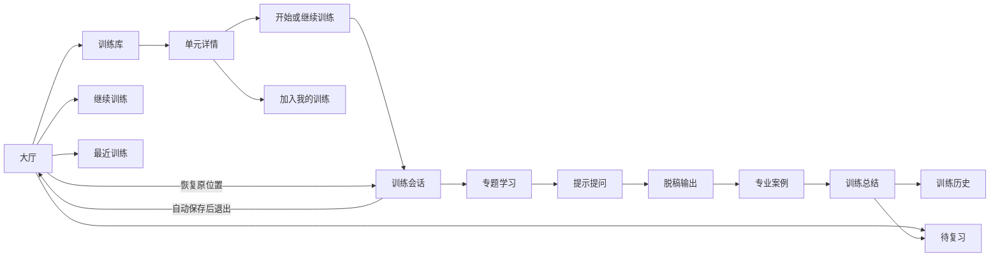

# 第1章\_回路产品导航与交互设计

## 1.1\_设计目标

回路应按照常见桌面 App 和移动 App 的操作习惯组织，而不是继续扩展成只允许从头走到尾的单页演示。用户在任何时刻都应知道：

- 当前位于哪个产品区域。
- 当前训练进行到哪个阶段和第几项。
- 哪些步骤已经完成、正在进行或尚未访问。
- 当前答案是否已经保存。
- 怎样回到大厅、继续训练或安全退出。

产品采用 **App 主导航 + 路由驱动页面 + 可恢复训练会话 + 页面内步骤导航**。浏览器前进、后退、刷新和地址复制应与应用状态一致。

## 1.2\_核心信息架构



### 1.2.1\_主导航

桌面端主导航固定为：

1. 大厅。
2. 训练库。
3. 我的训练。
4. 待复习。
5. 训练历史。
6. 知识源。
7. 设置。

训练分类属于“我的训练”内部能力，不单独占用顶层导航。移动端使用“大厅、训练库、训练、复习、我的”五项底部导航，其余入口进入“我的”。

### 1.2.2\_大厅

大厅是产品首页，也是所有训练会话的安全返回点。大厅至少展示：

- 继续上次训练：专题、阶段、题号、上次保存时间和预计剩余时间。
- 进行中的训练：按最近保存时间展示最多 3 项，并提供“查看全部”。
- 今日待复习：需要重建、部分输出和到期复习任务。
- 最近训练：最近使用的 3～5 个单元及进度。
- 快速开始：最近使用、用户收藏、当前可用单元、随机复习和从用户分类开始。具体专题来自数据目录，页面不得写死 RCU、红黑树或哈希表。
- 知识源与本地保存状态。

大厅不能只是产品介绍页。存在未完成训练时，最近保存的一项显示为“继续训练”主要操作；其他未完成会话进入“进行中的训练”。用户手动置顶的会话优先于最近保存时间，待复习项目不能覆盖继续训练入口。

预计时间由训练单元和任务清单提供，不根据文本长度临时猜测。剩余时间是未完成任务预计时间之和；至少积累 3 次同类训练记录后，才允许用个人历史耗时形成个性化估算，并明确标记为估算值。

## 1.3\_回到大厅

### 1.3.1\_入口

训练页顶部始终显示：

```text
[回到大厅]  专题名称 / 当前阶段 / 当前题目        保存状态
```

桌面端可以同时显示品牌图标和“回到大厅”文字；窄屏至少保留带可访问标签的大厅图标。训练内容滚动时，该入口和保存状态保持可见。

### 1.3.2\_返回规则

点击“回到大厅”时按以下顺序执行：

```text
停止当前输入合并计时
    ↓
保存答案、提示层级、自评和当前题号
    ↓
保存训练会话当前位置
    ↓
保存成功后进入大厅
    ↓
大厅生成“继续训练”卡片
```

- 已保存：直接返回大厅。
- 正在保存：显示“正在保存并返回”，成功后跳转。
- 保存失败：默认留在当前训练页，显示“重试保存”“导出当前草稿后离开”和“放弃未保存修改并离开”。最后一项必须明确展示可能丢失的字段和最近一次成功保存时间。
- 没有任何输入：仍保存当前位置，避免重新定位。
- 返回大厅不结束训练、不提交答案、不清空提示和自评。

“回到大厅”“结束本次训练”和“放弃本次训练”是三个不同动作：

- 回到大厅：保存并暂停，会话可以继续。
- 结束本次训练：提交当前允许提交的内容，生成阶段性总结。
- 放弃本次训练：由用户选择保留草稿或移入回收站，不生成完成结论。

### 1.3.3\_继续训练

大厅的“继续训练”必须恢复：

- 相同训练会话 ID。
- 相同训练计划版本。
- 当前阶段和题号。
- 已填写答案。
- 已展开提示。
- 已完成步骤。
- 用户自评。
- 阅读和拓扑训练进度。

如果对应训练计划已经更新，应提示“当前会话继续使用创建时的版本”，不能静默替换题目。

大厅存在多个未完成会话时，“继续训练”恢复最近或用户置顶的会话；其他会话从进行中列表进入。同一训练计划版本和会话用途默认只保留一个活跃会话；同一训练单元可以在不同用户模块、计划版本和复习上下文中分别存在活跃会话。用户明确选择“重新开始”时创建新会话，并询问暂停还是放弃相同计划上下文中的旧活跃会话。

## 1.4\_路由设计

建议路由：

```text
/                                      # 大厅
/library                               # 训练库
/library/units/:unitId                 # 单元详情
/my-training                           # 用户分类与训练模块
/my-training/modules/:moduleId/edit    # 模块编辑
/sessions/:sessionId/learning/:itemId  # 专题学习章节；learning 是稳定内部路由名
/sessions/:sessionId/guided/:itemId    # 提示提问
/sessions/:sessionId/reconstruction/:itemId
/sessions/:sessionId/professional/:itemId
/sessions/:sessionId/summary
/review
/history
/sources
/settings
```

题目路由必须使用稳定题目 ID，不能使用数组下标或当前显示序号。浏览器后退按用户实际访问历史导航；应用内“上一步”按训练计划顺序导航，两者不能假装等价。路由切换前先提交当前内存草稿的保存请求；保存失败时默认暂停导航，但用户仍可选择导出草稿后离开或明确放弃未保存修改，系统不能形成无法退出的死路。

刷新页面后通过会话 ID 恢复状态。路由守卫必须处理会话不存在、会话已回收、题目不属于对应阶段或会话快照、知识来源暂不可用和 URL 参数无效。错误页提供回到大厅、返回合法当前位置和查看诊断信息入口，不自动创建或猜测会话。

## 1.5\_训练步骤导航

训练页使用独立步骤导航：

```text
✓ 专题学习
● 提示提问
○ 脱稿输出
○ 专业案例
○ 训练总结
```

规则：

- 所有阶段始终可以直接进入，不以完成前一阶段作为导航权限。
- 当前步骤高亮。
- 每个阶段记住上次停留的稳定题目 ID，切回时恢复该位置。
- 未访问、已访问和已完成必须使用不同状态，点击阶段本身不能伪造完成。
- 修改以前步骤的答案后，受影响的后续自评标记为“需要重新确认”，但不直接删除。
- 步骤项必须是可聚焦的按钮或链接，不能用看似可点击的静态文本。

每个训练页面底部提供：

```text
[上一步]        当前进度        [保存草稿]  [下一步]
```

“查看答案”“提交本题”“完成自评”和“进入下一题”必须是不同动作，不能用一个按钮同时承担。

顶部“回到大厅”是训练会话的唯一固定退出入口，底部不重复放置。浏览器后退、应用内上一步和回到大厅分别承担访问历史、训练顺序和安全暂停三种语义。

## 1.6\_训练库与单元详情

训练库提供搜索、领域、状态和排序。单元卡片整体可以进入详情，并根据会话状态显示：

- 开始训练。
- 继续训练。
- 再次训练。

单元详情包含主题要解决的问题、四阶段路线、预计时间、任务数量、知识来源、历史训练和加入用户训练模块操作。详情页始终有返回训练库入口。

## 1.7\_训练体验

### 1.7.1\_专题学习

页面顺序为：

```text
学习目标
→ 问题场景
→ 提炼后的机制推演
→ 有明确答案的核验问题
→ 开放联想
→ 拓扑记忆重建
→ 原文依据
```

支持阅读进度、个人笔记、稍后复习、原文侧栏或新页打开。查看答案不等于完成学习。

### 1.7.2\_提示提问

依次展示场景、问题、用户答案、逐级提示、参考模型、易错点和关键点核验。自评之外允许用户勾选实际覆盖的关键点。

### 1.7.3\_脱稿输出

默认隐藏原文和提示，支持文本、列表、Mermaid 和简单拓扑草图。提交后再显示核验清单；暂存、提交、查看核验和完成自评是不同状态。

### 1.7.4\_专业案例

回答区域拆为：

- 诊断。
- 因果链。
- 解决方案。
- 不可规避成本。
- 不适用边界。

结构化答案便于用户复盘和比较多次训练结果。

## 1.8\_训练总结与复习

总结页显示各阶段完成情况、薄弱项、建议复习时间和下一步操作，至少提供：

- 立即复习薄弱项。
- 回到大厅。
- 查看训练记录。
- 再次训练。

复习数据拆成三个正交维度，不能压缩进同一个字段：

- 本次表现：需要重建、部分输出、完整输出。
- 掌握状态：学习中、复习中、已掌握。
- 调度状态：未安排、已安排、已到期、已推迟。

用户可以指定下次复习时间；再次训练创建新会话，不覆盖历史答案。

## 1.9\_管理操作

分类和训练模块管理使用正式页面、抽屉或对话框，不使用浏览器 `prompt()`。

- 创建和修改使用带字段校验的表单。
- 移动和排序同时支持拖拽与按钮操作。
- 删除默认进入回收站，并提供撤销提示。
- 合并前展示分类、模块、训练计划和历史记录的影响预览。
- 导入前展示创建数量、知识源缺失、ID 冲突和处理策略，不直接覆盖工作区。
- 所有写操作显示“保存中、已保存、保存失败”状态。

## 1.10\_视觉与无障碍

- 保留墨绿色品牌和适度的知识阅读气质。
- 正文优先使用易读无衬线字体，标题可以少量使用衬线风格。
- 管理页使用 App 布局，训练页使用专注布局。
- 每个操作区最多一个主要按钮。
- 所有可点击元素提供悬停、键盘焦点、按下和禁用状态。
- 未访问、进行中和已完成状态不能只依赖颜色。
- 桌面端使用可折叠侧栏，移动端使用底部导航和抽屉。
- 页面、表单、对话框和训练步骤必须支持键盘顺序与屏幕阅读标签。

移动端“训练”入口根据会话数量路由：只有一个活跃会话时直接恢复；存在多个时进入进行中会话列表；没有活跃会话时进入训练库并显示选择引导。

## 1.11\_相关设计

本文件只负责产品导航、页面结构和用户操作语义。以下细节由独立文档约束：

- [训练会话状态与持久化](training_session_state_and_persistence.md)：状态机、步骤完成、自动保存、计划快照和异常恢复。
- [复习调度与训练历史](review_scheduling_and_history.md)：表现、掌握状态、到期调度和历史比较。
- [导入导出与数据安全](../engineering/import_export_and_data_safety.md)：包类型、冲突预览、隐私、回滚和知识源映射。
- [知识提炼、训练适配与 AI 治理](content_adaptation_and_ai_governance.md)：模型授权、提示注入、证据、审核和发布。
- [本地服务安全与威胁模型](../engineering/local_service_security_and_threat_model.md)：同源、令牌、路径和不可信内容。
- [无障碍、性能与验收标准](../engineering/accessibility_performance_and_acceptance.md)：键盘、焦点、响应式、性能和交付门槛。

## 1.12\_实施顺序

本节描述目标实施顺序，不代表各项已经验收。当前完成度、偏差和验证证据统一记录在 [实现状态与版本边界](../implementation_status.md)。

### 1.12.1\_第一阶段\_基本可用性

1. 引入路由和大厅。
2. 实现回到大厅、继续训练和会话恢复。
3. 实现浏览器前进、后退和刷新恢复。
4. 增加单元详情页。
5. 训练步骤可返回，补充上一步、下一步和退出并保存。
6. 增加自动保存、失败重试和明确状态。
7. 将 `prompt()` 管理操作替换为正式表单。
8. 增加确认、撤销、空状态、加载状态和错误状态。

### 1.12.2\_第二阶段\_学习与复习体验

1. 阅读进度、笔记和收藏。
2. 答案关键点核验。
3. 结构化专业案例回答。
4. 薄弱项复习和历史比较。
5. 原文侧栏与并排阅读。

### 1.12.3\_第三阶段\_增强能力

1. 拓扑图交互编辑。
2. 自定义训练顺序。
3. 内容提炼草稿审核。
4. 训练计划版本管理。
5. 复习调度。
6. 多设备同步。

第一阶段完成前，不继续在旧单页状态机上叠加临时按钮或兼容路径。

当前第一版已经移除旧单页状态机，落地路由、大厅、单元详情、会话恢复、步骤导航、IndexedDB 自动保存和正式管理表单。返回大厅前等待强制保存结果、撤销、统一错误诊断和完整无障碍验收仍未完成，因此第一阶段不能标记为全部验收通过。
