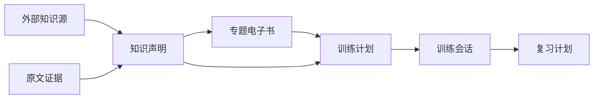

# 第1章\_专题电子书与知识治理设计

## 1.1\_目标

回路把用户指定的知识来源提炼成可独立完成首次学习的专题电子书，再基于电子书中的章节和知识声明组织训练。电子书不是原文导入、摘要拼接或一道加长的学习题，而是具有目录、章节依赖、权威结论、证据和版本的正式内容产品。



| 层次 | 职责 | 禁止承担 |
| --- | --- | --- |
| 知识源 | 提供原始事实、解释和源码证据 | 决定用户训练分类 |
| 知识声明 | 规范化结论、去重、冲突和版本边界 | 承担完整阅读叙事 |
| 专题电子书 | 目录、章节、因果推演和阅读导航 | 保存用户答案 |
| 训练计划 | 选择章节和声明并组织训练 | 复制完整教材 |
| 训练会话 | 保存快照、答案、阅读和训练进度 | 修改已发布内容 |

## 1.2\_内容包结构

```text
topic/
├── unit.json
├── book.json
├── outline.md
├── chapters/
├── knowledge/
│   ├── claims.json
│   ├── relations.json
│   └── source_map.json
└── training/
    ├── plan.json
    ├── chapter_checks.json
    ├── guided_questions.json
    ├── model_tasks.json
    └── professional_cases.json
```

`unit.json` 只负责训练库登记所需的单元身份、权威知识来源和电子书入口。电子书内容、知识治理数据和训练内容分别由 `book.json`、`knowledge/` 和 `training/` 拥有。

## 1.3\_电子书与大纲

`book.json` 是机器可读清单，保存稳定书籍 ID、版本、状态、有序章节、前置章节、知识声明、知识来源和训练计划入口。章节顺序只由清单决定，不能依赖文件系统遍历或文件名猜测。

`outline.md` 面向读者说明整本书的因果学习链。每章必须明确本章问题、前置结论、前章缺口、本章结论和下一章问题；不得复制章节正文或登记不存在的章节。

## 1.4\_章节正文

章节使用 Markdown 保存，并遵循“现实问题 → 原方案价值 → 具体缺口 → 机制推演 → 系统映射 → 代价与选择边界”的主线。单章边界由一个可以闭合的问题决定，而不是由固定字数或屏幕高度决定。

章节至少包含本章问题和目标、必要场景、可复现的因果推演、反例或不适用边界、本章结论、下一章问题以及可追溯知识声明。电子书正文与原文分离，引用原文用于核验，不复制知识库完整教程。

## 1.5\_知识声明与去重

`claims.json` 保存稳定声明 ID、单一陈述、类型、审核状态、适用版本、唯一权威章节和证据 ID。声明状态固定为：

```text
candidate
reviewing
verified
conflicting
version_bound
superseded
rejected
```

同一结论只能有一个权威章节。其他章节可以引用或应用，但不得重新维护完整推导。校验器阻止重复声明 ID、多个权威章节、无证据的已验证声明和不存在的章节引用。

## 1.6\_关系与知识拓扑

`relations.json` 使用稳定声明 ID 表达有方向的语义关系，类型限定为：

```text
requires
enables
causes
prevents
contradicts
refines
implements
bounds
trades_for
alternative_to
```

关系用于生成知识拓扑、章节依赖检查、开放联想和薄弱项回溯，不能退化成无方向标签集合。

## 1.7\_证据、冲突与纠错

`source_map.json` 把证据连接到知识声明，并记录知识源 ID、稳定文档 ID、相对路径、标题定位、证据类型和审核状态。

存在冲突时，声明转为 `conflicting`，保存原因和各方证据，并阻止它进入确定性标准答案。人工解决后记录采用结论和被替代声明，再检查受影响章节与训练题。纠错不得只覆盖正文而丢失决策过程。

## 1.8\_训练绑定

`training/plan.json` 冻结电子书版本、学习章节顺序和三个训练阶段入口。训练题必须引用章节 ID、知识声明 ID 和知识来源闭包。用户答错后系统应能回到具体章节，而不是要求重新阅读整本书。

章节阅读、训练完成和掌握状态是三种独立状态。所有章节和训练阶段都允许自由访问，访问本身不改变完成状态。

## 1.9\_阅读界面

桌面端目标为“书籍目录 | 连续章节正文 | 本章目录、声明与证据”三层工作台。第一版至少实现电子书大纲、可点击章节目录、上一章与下一章、每章独立 URL、分章节阅读位置、阅读状态、本章声明和原文依据。

移动端把目录与上下文收进抽屉，但不改变章节身份、URL 和阅读状态语义。

## 1.10\_版本与快照

电子书使用稳定 `book_id`、语义化 `book_version` 和内容摘要。事实纠错必须记录勘误和受影响声明。历史训练继续引用创建时的电子书与训练计划快照，新会话使用当前发布版本。

## 1.11\_发布质量门

发布依次通过声明门、大纲门、正文门和训练门。AI 只能产生候选声明和章节草稿，不能直接把冲突结论标为已验证，也不能绕过人工审核发布。

## 1.12\_相关设计

- [专题电子书编写与提炼标准](topic_ebook_editorial_standard.md)
- [知识提炼、训练适配与 AI 治理](content_adaptation_and_ai_governance.md)
- [训练会话状态与持久化](training_session_state_and_persistence.md)
- [工程结构与模块边界](../engineering/project_structure_and_module_boundaries.md)
- [不可变训练计划快照决策](../decisions/0003-immutable-training-plan-snapshot.md)
