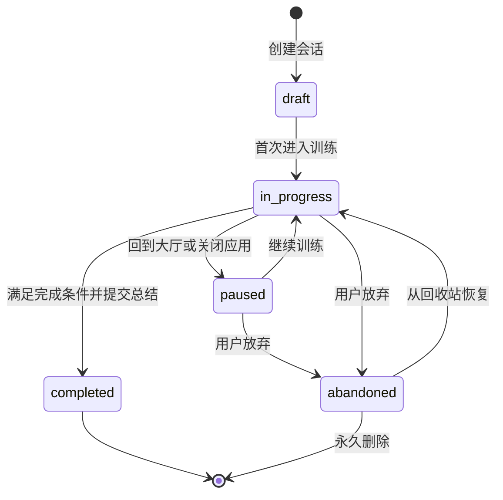
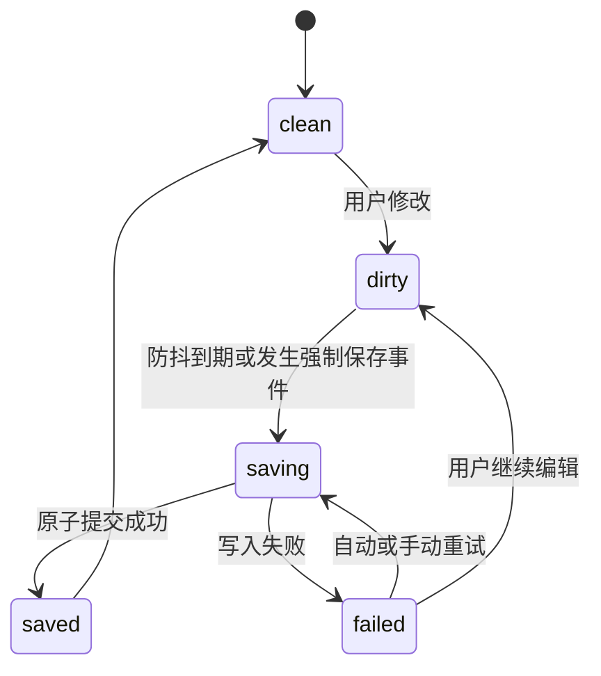

# 第1章\_训练会话状态与持久化设计

> 本文定义完整目标模型。当前第一版已经实现内容快照、稳定题目路由、顺序解锁、IndexedDB 会话和防抖自动保存，但尚未实现完整暂停/放弃事件、多标签页租约和修订日志。具体边界见 [实现状态与版本边界](../implementation_status.md)。

## 1.1\_目标与术语

训练内容、训练计划和训练会话必须分开：

| 对象 | 含义 | 是否可变 |
| --- | --- | --- |
| 训练单元 | 随内容包发布的学习导引和训练任务 | 新版本可更新 |
| 训练模块 | 用户选择和排序的一组训练单元 | 用户可编辑 |
| 训练计划版本 | 某次适配后可执行的确定内容 | 发布后不可原地修改 |
| 训练会话 | 用户针对一个计划版本的一次实际训练 | 训练过程中追加状态 |
| 题目作答修订 | 某道题的一次保存或提交记录 | 追加新修订 |

训练会话必须引用确定的训练计划版本。内容包、用户模块或知识源更新不得静默改变正在进行或已经完成的会话。

## 1.2\_会话状态机



状态语义：

- `draft`：会话和计划快照已经创建，但用户尚未进入第一项训练。
- `in_progress`：用户已经开始训练，允许自动保存和步骤推进。
- `paused`：保留全部状态，但不视为完成或放弃。
- `completed`：完成必要阶段并提交训练总结，历史记录只追加新修订。
- `abandoned`：从活跃列表移除，默认进入回收站。第一版本地数据不自动清空，用户主动永久删除前都可恢复。

回到大厅把 `in_progress` 转为 `paused`。应用被关闭或超过空闲阈值时，可以在下次加载时把最后状态解释为 `paused`，但不得伪造一条未发生的用户操作记录。

活跃会话唯一性由 `workspace_id + training_plan_version_id + session_purpose` 决定，而不是只由训练单元 ID 决定。`session_purpose` 至少区分首次训练、用户模块训练和复习。用户明确选择“重新开始”时创建新会话，并选择暂停或放弃相同上下文中的旧会话。已完成会话永远不被再次训练覆盖。

## 1.3\_阶段与题目状态

阶段状态：

```text
locked
available
in_progress
completed
needs_reconfirmation
```

题目状态：

```text
unvisited
viewed
drafted
submitted
self_reviewed
completed
```

阶段解锁和完成条件：

| 阶段 | 解锁条件 | 完成条件 |
| --- | --- | --- |
| 学习导引 | 会话开始 | 所有导引项完成学习自评；核验答案可以查看，但查看本身不等于完成 |
| 提示提问 | 学习导引完成 | 每题至少提交一次答案、记录提示使用情况并完成关键点核验与自评 |
| 脱稿输出 | 提示提问完成 | 每项输出已提交、查看核验清单并完成自评 |
| 专业案例 | 脱稿输出完成 | 必填回答区域已经提交并完成自评 |
| 训练总结 | 专业案例完成 | 用户确认总结并选择下一步复习动作 |

开放联想没有唯一答案，不参与机械对错判断；但用户必须留下思考记录或明确选择“本轮跳过”。专业案例中“未填写”和“判断无此项”使用不同状态。

返回旧步骤修改已提交答案时，受其依赖的后续阶段标记为 `needs_reconfirmation`。系统保留后续答案，不自动清除；用户重新查看并确认后恢复完成状态。

## 1.4\_训练计划快照

创建会话时冻结：

- 训练计划 ID 和版本。
- 单元 ID、内容 Schema 版本和内容摘要。
- 阶段顺序。
- 稳定题目 ID 和显示顺序。
- 题目正文、提示、核验点和评分维度的内容摘要。
- 知识来源 ID、稳定文档 ID 和相对路径。
- 每项预计时间。
- 创建时使用的语言和影响题目解释的设置。

所有稳定身份使用复合边界：

```text
知识正文：source_id + document_id + document_version/content_digest
训练任务：content_package_id + task_id + task_version
训练计划：training_plan_id + plan_version
训练会话：workspace_id + session_id
```

显示名称、目录路径和数组序号都不能作为身份。外部内容包中的 ID 只在其内容包命名空间内要求唯一。

快照可以保存完整训练内容，也可以保存不可变内容包的版本和摘要；无论采用哪种方式，都必须能够在内容更新后重放原训练。只保存 `plan_version` 而仍从当前可变 JSON 加载题目不满足要求。

知识源失联不阻止已冻结的训练继续执行。原文入口显示“暂不可访问”，保留原引用和重新映射入口。

## 1.5\_自动保存状态机



保存策略：

- 普通输入在停止编辑 800～1500 毫秒后防抖保存。
- 切换题目、切换阶段和回到大厅前触发强制保存。
- `visibilitychange` 进入隐藏状态时尽早发起保存；`pagehide` 和应用关闭只做尽力提交，不承诺异步写入一定完成。
- 自动保存不得阻塞键盘输入。
- 页面显示最近一次成功保存时间，不以发起保存的时间冒充完成时间。
- 保存失败时保留内存草稿，并提供重试和导出当前答案。用户仍可选择“导出草稿后离开”或“放弃未保存修改并离开”；系统必须展示可能丢失的修订范围，不能把数据保护变成无法退出。
- 连续失败不得无限弹出通知；页面保持可见失败状态。

每次写入携带：

```text
session_id
entity_id
base_revision
next_revision
device_instance_id
updated_at
payload_checksum
```

存储层使用事务同时提交答案修订、当前题号和保存状态。旧修订不能覆盖新修订。浏览器崩溃时，正常情况下最多丢失最后一个防抖窗口内的输入。

## 1.6\_多标签页与并发冲突

同一设备多个标签页可能同时打开同一会话。第一阶段采用单写者租约：

- 第一个获得租约的标签页可编辑。
- 其他标签页以只读方式打开，并提供“接管编辑”。
- 租约通过心跳续期，异常关闭后自动过期。
- 接管前比较最新修订；发现分叉时禁止静默覆盖。

租约包含递增的 fencing token。每次写入校验 token，已经失去租约的旧标签页即使稍后恢复运行也不能继续写入。后台标签页可能被浏览器节流，因此租约超时、心跳频率和接管等待时间必须由常量统一配置并通过暂停后台标签页的测试验证，不能只依赖墙上时钟。

未来多设备同步仍使用修订号和明确冲突处理，不采用最后写入时间无条件覆盖。不同题目的独立修改可以合并；同一题目同一字段的并发修改必须让用户选择版本或保留两个修订。

## 1.7\_路由守卫与恢复

路由使用稳定题目 ID：

```text
/sessions/:sessionId/:stage/:itemId
```

守卫顺序：

1. 校验会话 ID 和题目 ID 格式。
2. 加载会话和计划快照。
3. 检查会话是否已回收或永久删除。
4. 检查阶段和题目是否属于快照。
5. 检查阶段是否解锁。
6. 恢复最近成功保存的修订。

异常处理：

| 情况 | 行为 |
| --- | --- |
| 会话不存在 | 显示错误页，提供回到大厅 |
| 会话已回收 | 提供恢复或回到大厅 |
| 题目不属于快照 | 返回会话最后合法位置 |
| 阶段未解锁 | 说明解锁条件并返回当前阶段 |
| 存储读取失败 | 不创建空会话覆盖原数据，提供重试和备份导出 |
| 内容包更新 | 继续使用快照，并提示存在新版本 |

浏览器后退按访问历史移动；应用内“上一步”按计划顺序移动。二者在离开当前题目前都必须刷新保存请求，但不能把浏览器历史重新解释成训练完成顺序。

## 1.8\_再次训练与历史

“再次训练”创建新会话并引用用户选择的计划版本：

- 使用原版本：用于严格比较两次表现。
- 使用最新版本：用于学习更新后的内容。

完成会话只允许追加备注、复习状态和新的答案修订，不原地重写首次提交。历史比较必须标明两次会话是否使用同一计划版本。

## 1.9\_存储与迁移

训练会话、答案修订和索引数据应使用 IndexedDB 或受控本地服务持久化；`localStorage` 只适合保存少量界面偏好和一次性迁移标记，不作为长期训练数据主存储。

数据库至少包含：

```text
training_plan_versions
practice_sessions
session_stage_states
answer_revisions
session_leases
application_metadata
```

Schema 升级使用单向、带事务的数据迁移。迁移失败保留旧数据库并进入只读恢复模式，不得半迁移后继续运行。

## 1.10\_验收条件

- 在任一训练阶段回到大厅，重新进入后恢复相同题目和输入。
- 刷新页面不丢失最后一次成功保存的数据。
- 同一会话在第二标签页打开时默认只读。
- 旧修订无法覆盖新修订。
- 修改已完成前置步骤后，后续状态变为需要重新确认而答案仍保留。
- 内容包更新后，旧会话仍能重放原题目。
- 保存失败时默认不导航且不显示虚假的“已保存”；用户明确选择导出后离开或放弃修改时可以退出。
- 浏览器后退、应用内上一步和回到大厅保持三种独立语义。
