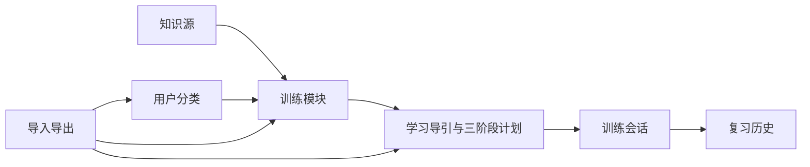

# 第1章\_回路工程结构与模块边界

## 1.1\_设计目标

回路采用按业务功能组织的 Feature-first 工程结构。目录必须能够回答“代码属于哪个产品能力、谁拥有数据、通过什么公开接口协作”，而不是只按组件、服务、工具函数等技术名称平铺。

工具只管理知识源注册、用户选择的训练范围、训练组织、训练计划和训练记录。知识正文的目录层级属于外部知识库；训练分类属于用户行为，两者不得互相覆盖。



## 1.2\_目标工程结构

```text
practice_tool/
├── src/
│   ├── app/                         # 应用入口与装配
│   ├── features/                    # 按业务功能组织
│   │   ├── knowledge-sources/
│   │   ├── training-categories/
│   │   ├── training-modules/
│   │   ├── training-plans/
│   │   ├── practice-sessions/
│   │   ├── review-history/
│   │   └── import-export/
│   ├── components/                  # 无业务含义的通用 UI
│   ├── infrastructure/              # 存储、知识访问和系统 API
│   └── shared/                      # ID、错误、时间等基础能力
├── server/                          # 受控本地服务
├── schemas/                         # 稳定数据协议
├── migrations/                      # 用户数据迁移
├── scripts/                         # 生命周期与校验脚本
├── tests/                           # 跨模块测试
├── docs/
├── examples/
└── config/
```

当前代码按增量重构方式向目标结构收敛。新业务代码不得继续堆入单体入口；已有启动、安装、卸载和平台环境职责保持原边界。

## 1.3\_模块内部约定

业务功能内部统一使用：

```text
feature-name/
├── components/     # 业务界面
├── hooks/          # React 与业务操作连接
├── model/          # 实体和永真规则
├── services/       # 创建、修改、合并等用例
├── tests/
└── index.ts        # 唯一公开入口
```

其他模块只能从 `index.ts` 使用公开能力，不得跨目录读取内部实现。业务规则不能放进 React 组件、IndexedDB 实现或 Vite 配置。

## 1.4\_数据所有权

| 数据 | 所有模块 |
| --- | --- |
| 知识源配置 | `knowledge-sources` |
| 用户分类及父子关系 | `training-categories` |
| 训练模块及材料引用 | `training-modules` |
| 学习导引、三阶段计划及版本 | `training-plans` |
| 单次作答和进度 | `practice-sessions` |
| 复习状态 | `review-history` |
| 外部数据格式 | `schemas` |
| 浏览器存储实现 | `infrastructure/persistence` |

删除分类不得删除训练模块；知识源暂时不可访问不得销毁材料引用；历史训练必须引用确定版本的计划，不能跟随当前计划静默变化。

## 1.5\_依赖纪律

```text
app/pages
    ↓
features
    ↓
model/services

app 负责向 features 注入 infrastructure 实现
```

- 模型层不依赖 React、文件系统、网络和浏览器存储。
- 业务操作不直接使用 `localStorage`、IndexedDB 或 `fetch`。
- 基础设施实现业务模块声明的持久化和访问接口。
- `shared` 只容纳真正无业务归属的基础代码。
- `linux-note` 的具体路径只能作为知识源配置或材料引用出现，不得成为工具程序的隐式运行依赖。

## 1.6\_训练工作区基本操作

训练分类支持创建、修改、父子组织、合并、回收和恢复。训练模块支持创建、修改、关联分类、组合训练单元、合并、回收和恢复。工作区支持版本化 JSON 导入导出。

合并分类只迁移组织关系，不合并题目；合并训练模块对材料和分类关系去重，随后应重新适配训练计划。删除默认进入回收站，永久删除属于后续独立确认动作。

## 1.7\_当前实现基线

当前版本已经提供 RCU、红黑树和哈希表三个并列训练单元，共 15 个训练任务。训练流程统一为：

```text
提炼后的学习导引
    ↓
提示提问
    ↓
脱稿输出
    ↓
专业案例
```

训练内容通过 `banks/index.json` 和单元协议自动发现；新增其他专题不得在 React 页面中添加专题判断。用户训练分类和训练模块使用独立工作区数据，不写回知识库目录。学习导引保留知识源 ID、稳定文档 ID 和相对路径，并通过受控只读接口打开注册知识源内的 Markdown 原文。
