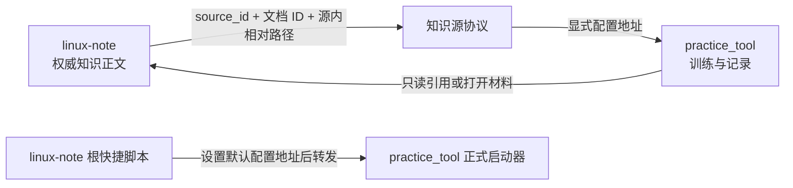
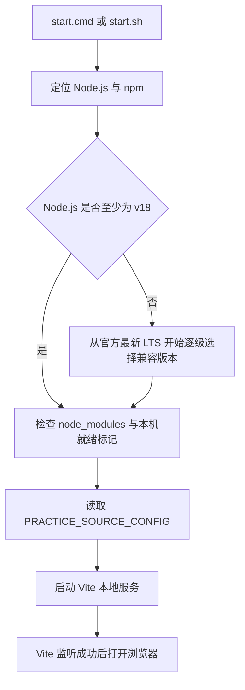

# 第1章\_回路训练工具跨平台与仓库独立性设计

## 1.1\_文档目的

本文是 `practice_tool` 跨平台运行和仓库独立性设计的长期锚点，用于约束后续的题库导入、在线编辑、知识源浏览、答案导出以及独立拆仓工作。

需要长期保持的核心结论是：

> `linux-note` 是独立知识库，`practice_tool` 是独立训练工具。二者只能通过显式的知识源协议交互，不能通过外层目录位置、根启动脚本或仓库内部约定形成隐式依赖。

当前两个项目暂时位于同一 Git 仓库，只是开发和使用阶段的物理共置，不代表产品所有权或运行边界相同。

## 1.2\_系统角色与所有权

### 1.2.1\_practice_tool拥有的内容

`practice_tool` 自己拥有：

- 训练流程、界面和浏览器本地状态。
- 模块、单元、阶段和题目的数据协议。
- 题库索引与题库内容包。
- 知识源注册协议和解析逻辑。
- Windows、MSYS2 和 Linux 的正式启动入口。
- 环境安装、内容校验、构建和测试脚本。
- 导入、导出、在线编辑和外部 AI 评审协议。
- 工具自身的说明、设计和排障文档。

这些内容必须全部收敛在 `tools/practice_tool` 内。将该目录移动为新仓库根目录后，工具应能继续安装、校验、构建和启动。

### 1.2.2\_linux-note拥有的内容

`linux-note` 自己拥有：

- `knowledge` 等目录中的权威知识正文。
- 文档稳定 ID、知识结构和仓库治理规则。
- Atlas、实验、项目、源码证据和出版编排。
- `linux-note` 提供给训练工具的知识源注册信息。
- 为本仓库用户提供的根目录快捷启动脚本。

`linux-note` 不拥有训练工具的内部流程、数据存储或启动实现。训练工具也不能要求 `linux-note` 为其改变知识库信息架构。

### 1.2.3\_允许的交互面

两个项目之间只允许出现以下交互：



根快捷脚本是使用便利层，不是项目依赖层。删除根目录的 `practice.cmd` 和 `practice.sh` 后，训练工具必须仍可从自身目录启动。

## 1.3\_依赖方向

依赖方向必须保持单向：

```text
practice_tool 核心
    ↓ 读取通用知识源协议
知识源配置
    ↓ 注册具体来源
linux-note 或其他知识库
```

禁止出现反向渗透：

- 工具代码写死 `../../knowledge`。
- 工具根据目录名猜测自己位于 `linux-note`。
- 工具启动器读取仓库根 `AGENTS.md`、Atlas 或治理文件。
- `linux-note` 根启动脚本复制 Node.js 检测、依赖安装或 Vite 启动逻辑。
- 题库只保存文件路径而不保存 `source_id` 和稳定文档 ID。
- Windows 和 Linux 分别维护不兼容的知识源配置格式。

## 1.4\_知识源协议

### 1.4.1\_训练材料引用

训练单元中的每一项权威材料引用由三部分组成：

```json
{
  "source_id": "linux-note",
  "id": "knowledge.linux.synchronization.rcu.why_rcu",
  "path": "knowledge/linux/synchronization/rcu/P01_为什么需要_RCU.md"
}
```

三者职责不同：

| 字段 | 职责 |
| --- | --- |
| `source_id` | 指向一项知识源注册，不随安装位置变化 |
| `id` | 标识知识源内部的稳定文档身份，不随文件移动轻易变化 |
| `path` | 在当前版本知识源中定位材料，必须是源内相对路径 |

`path` 不是跨仓库永久身份。文档移动后可以更新路径，但不应因此重写题目 ID、文档 ID或训练历史。

### 1.4.2\_知识源注册

知识源真实地址通过独立 JSON 文件注册：

```json
{
  "schema_version": 1,
  "sources": [
    {
      "id": "linux-note",
      "title": "Linux Note 知识库",
      "kind": "filesystem",
      "location": "."
    }
  ]
}
```

配置 Schema 位于：

```text
schemas/knowledge_sources.schema.json
```

工具内示例位于：

```text
config/knowledge_sources.example.json
```

当前 `linux-note` 集成配置位于仓库根目录：

```text
practice.sources.json
```

### 1.4.3\_配置地址

启动时通过统一环境变量指定知识源注册文件：

```text
PRACTICE_SOURCE_CONFIG
```

Windows PowerShell：

```powershell
$env:PRACTICE_SOURCE_CONFIG = "D:\knowledge\practice.sources.json"
.\start.cmd
```

Linux 或 MSYS2：

```bash
PRACTICE_SOURCE_CONFIG=/srv/knowledge/practice.sources.json bash ./start.sh
```

未设置环境变量时，工具可以读取自身的本机配置：

```text
config/knowledge_sources.local.json
```

该文件不进入 Git。两处配置都不存在时，工具仍应正常启动，并明确显示知识源未配置，不能隐式回退到外层仓库。

### 1.4.4\_地址解析规则

- `filesystem` 可以使用绝对路径或相对于配置文件的路径。
- 文件系统相对地址以配置文件所在目录为基准，不以终端当前目录为基准。
- `http` 使用绝对 URL，或使用相对于远程配置 URL 的地址。
- 远程配置不得声明启动机器的 `filesystem` 地址。
- 路径解析统一由 Node.js 完成，业务代码不得自行拼接 `\` 或 `/`。
- 前端不得把文件系统路径当成 HTTP URL。

## 1.5\_跨平台启动模型

### 1.5.1\_统一阶段

Windows 和 Linux 入口文件语法不同，但必须执行相同阶段：



入口脚本只处理平台外壳差异，训练流程和知识源语义必须共用 TypeScript、JSON Schema 与 Node.js 实现。

### 1.5.2\_正式入口

工具正式入口为：

| 平台 | 入口 |
| --- | --- |
| Windows CMD、PowerShell | `start.cmd` |
| MSYS2、Linux Bash | `start.sh` |

当前知识库根目录的 `practice.cmd` 和 `practice.sh` 只承担：

1. 在用户没有指定时，把 `PRACTICE_SOURCE_CONFIG` 指向 `linux-note` 的集成配置。
2. 把参数和退出状态转发给工具正式入口。

除此之外不得加入依赖安装、题库加载或服务启动逻辑。

### 1.5.3\_平台差异边界

允许的平台差异：

- CMD 与 Bash 语法。
- Node.js 的发现和安装方式。
- Windows `winget`、MSYS2 `pacman` 和普通 Linux 的隔离运行时。
- Vite 调用平台默认浏览器的实现。
- 文件系统路径的系统表示。

不允许的平台差异：

- 不同的题库格式。
- 不同的知识源 Schema。
- 不同的训练记录格式。
- 不同的导入导出包。
- 分叉的训练业务逻辑。

## 1.6\_当前实现状态

截至当前版本，已经完成：

- 工具正式启动入口下沉到工具目录。
- 根启动脚本精简为集成快捷入口。
- 启动前检查 Node.js 18 最低兼容线；安装时从官方最新 LTS 开始逐级回退，普通 Linux 使用工具内隔离运行时。
- 浏览器由 Vite 在监听成功后打开，不再依赖固定等待时间。
- Windows 与 Linux 共享 `PRACTICE_SOURCE_CONFIG` 契约。
- 支持从本地文件或 HTTP/HTTPS 地址读取知识源注册。
- 支持 `filesystem` 和 `http` 两类知识源描述。
- 题库材料引用包含 `source_id`、稳定文档 ID 和源内相对路径。
- 知识源配置具有 JSON Schema 和示例。
- 界面能够显示已配置知识源数量以及单元使用的来源。
- 没有配置知识源时，工具仍可独立运行。

尚未完成：

- 浏览器通过受控本地服务读取 `filesystem` 正文。
- HTTP 知识源正文抓取与跨域处理。
- 知识源连通性和文档 ID/path 一致性检查。
- 在浏览器中新增、编辑和保存知识源。
- 内容包导入时的来源映射和冲突处理。
- 工具独立仓库的 CI 和跨平台自动化测试矩阵。

## 1.7\_后续演进约束

### 1.7.1\_读取本地正文

浏览器不能直接任意读取本机文件。后续应由只监听 `127.0.0.1` 的本地服务读取已注册的 `filesystem` 知识源，并满足：

- 只允许访问注册根目录内部。
- 解析并校验最终绝对路径，拒绝 `..` 逃逸。
- 默认只读。
- 不向远端页面暴露本机文件接口。
- 错误信息区分知识源缺失、文档移动、权限不足和协议不兼容。

### 1.7.2\_在线编辑与保存

训练工具编辑自己的题库和用户答案，不应默认编辑 `linux-note` 权威正文。若未来允许编辑知识源，必须由知识源单独声明写入能力，并要求用户明确进入内容维护模式。

### 1.7.3\_导入导出

题库包和答案包必须携带：

- 格式与 Schema 版本。
- 内容包、单元、阶段和题目稳定 ID。
- 所引用的 `source_id` 和文档 ID。
- 生成时间与内容版本。

导入到另一台机器时允许重新映射知识源地址，但不得通过改写题目正文掩盖来源缺失。

### 1.7.4\_独立拆仓验收

正式拆分前至少验证：

```text
复制 tools/practice_tool 为新仓库
    ↓
删除 linux-note 根快捷脚本和所有外层目录
    ↓
Windows 与 Linux 分别完成首次启动
    ↓
无知识源配置时可以训练内置内容
    ↓
指定外部知识源配置后可以识别来源
    ↓
check:data、build 和跨平台测试全部通过
```

只有上述流程成立，才能认为工具完成仓库级独立，而不只是把代码放进了一个看似独立的目录。
